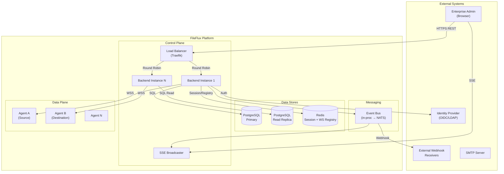
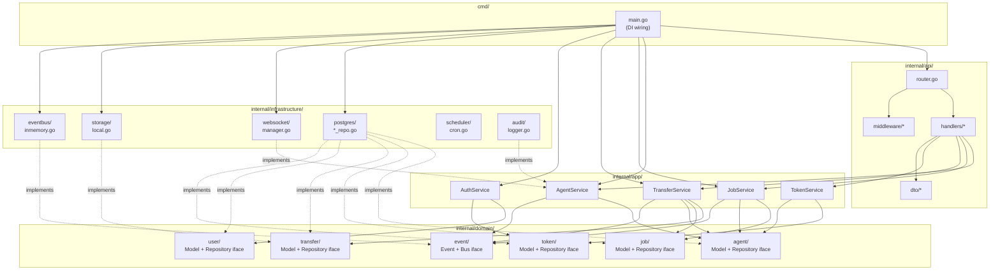

# FileFlux — Enterprise Architecture Review

**Version:** 1.0  
**Date:** 2026-02-12  
**Status:** Proposed  
**Reviewer:** Lead Architect  
**Focus:** Wartbar · Austauschbar · Skalierbar · Testbar

---

## Executive Summary

FileFlux is a self-hosted Managed File Transfer (MFT) platform at **pre-Phase 0** maturity. This review evaluates enterprise readiness across four pillars — **Maintainability**, **Exchangeability**, **Scalability**, **Testability** — and provides a concrete refactoring roadmap with Go interface definitions, package structures, and architecture diagrams.

### Verdict: NOT Enterprise-Ready

| Pillar | Score | Grade | Blocker |
|--------|-------|-------|---------|
| Maintainability | 2/10 | 🔴 | 3 competing architectures, duplicate packages, broken imports |
| Exchangeability | 1/10 | 🔴 | Zero interfaces on active path, concrete types everywhere |
| Scalability | 1/10 | 🔴 | In-memory file storage, single-instance only, backend relay bottleneck |
| Testability | 0/10 | 🔴 | Zero tests, tight coupling, no DI, no mocks possible |
| Security | 1/10 | 🔴 | Auth bypass (hardcoded `return 1, nil`), no TLS, no audit log |

**Critical Path to Enterprise:** 12-16 weeks of focused refactoring before any enterprise customer can be onboarded.

---

## Table of Contents

1. [Maintainability Assessment](#1-maintainability-assessment)
2. [Exchangeability Assessment](#2-exchangeability-assessment)
3. [Scalability Assessment](#3-scalability-assessment)
4. [Testability Assessment](#4-testability-assessment)
5. [Security Architecture](#5-security-architecture)
6. [Target Architecture](#6-target-architecture)
7. [Interface Definitions](#7-interface-definitions)
8. [Dependency Injection Strategy](#8-dependency-injection-strategy)
9. [Refactoring Roadmap](#9-refactoring-roadmap)

---

## 1. Maintainability Assessment

### 1.1 Current Package Structure — Problem Map

```
backend/
├── cmd/
│   ├── main.go                    ❌ Path B/C: Auth0, Stripe, godotenv — NOT used by docker-compose
│   └── server/
│       └── main.go                ❌ Path B: zap, gin, gorm — NOT used by docker-compose
├── internal/
│   ├── api/
│   │   └── router.go              ✅ ACTIVE: gorilla/mux, imports "fileflux/backend/internal/..."
│   ├── auth/
│   │   ├── auth.go                ❌ Auth0 go-jwt-middleware — NOT wired to router.go
│   │   └── auth0.go               ❌ Broken import: "github.com/your-username/fileflux/..."
│   ├── config/
│   │   └── config.go              ✅ ACTIVE: YAML loader
│   ├── database/
│   │   └── db.go                  ❌ Path B: Database interface + PostgresDB — NOT wired
│   ├── db/
│   │   ├── database.go            ✅ ACTIVE: raw *sql.DB, concrete struct
│   │   └── schema.sql             ✅ ACTIVE: 5 tables, CREATE IF NOT EXISTS
│   ├── handlers/
│   │   ├── auth_handler.go        ⚠️ Broken import: "github.com/your-username/fileflux/..."
│   │   ├── file_transfer.go       ⚠️ Imports pkg/config (Path B) — cross-path coupling
│   │   └── job_handler.go         ⚠️ Broken import: "github.com/your-username/fileflux/..."
│   ├── middleware/
│   │   └── auth.go                ❌ EMPTY: body is a comment only
│   ├── models/
│   │   ├── models.go              ✅ ACTIVE: Agent, error sentinels
│   │   ├── job.go                 ✅ ACTIVE: Job with int PKs
│   │   ├── transfer.go            ✅ ACTIVE: Transfer with int PKs
│   │   └── user.go                ✅ ACTIVE: User with int PKs, SubscriptionTier
│   ├── payment/
│   │   └── stripe.go              ❌ Broken import: "github.com/your-username/fileflux/..."
│   ├── scheduler/                 ❌ EMPTY directory
│   ├── services/
│   │   └── file_transfer_service.go ❌ In-memory map, 10MB limit, global mutable state
│   └── websocket/
│       ├── manager.go             ✅ ACTIVE: gorilla/websocket, hardcoded validateToken
│       └── protocol.go            ✅ ACTIVE: 8 message types defined
├── pkg/
│   ├── api/
│   │   └── server.go              ❌ Path B: gin.Engine + gorm.DB + zap — NOT used
│   ├── config/
│   │   └── config.go              ❌ Path B: env-only config (Auth0, Stripe) — NOT used
│   └── domain/
│       ├── agents/
│       │   ├── model.go           ❌ Path B: GORM models, uuid PKs — NOT used
│       │   └── repository.go      ❌ Path B: GORM repository — NOT used
│       └── jobs/
│           ├── model.go           ❌ Path B: GORM models — NOT used
│           ├── repository.go      ❌ Path B: GORM repository — NOT used
│           └── service.go         ❌ Path B: zap + GORM service — NOT used
└── src/
    ├── server.js                  ❌ Path C: Node.js Express — DEAD CODE
    └── utils/setupDb.js           ❌ Path C: Node.js DB setup — DEAD CODE
```

### 1.2 Redundancy Analysis

| Concept | Occurrences | Locations |
|---------|------------|-----------|
| Config | **3** | `internal/config/config.go` (YAML), `pkg/config/config.go` (env), `config.yaml` + `config.yml` (2 files!) |
| Database | **2** | `internal/db/database.go` (concrete), `internal/database/db.go` (interface) |
| API Server | **2** | `internal/api/router.go` (mux), `pkg/api/server.go` (gin) |
| Models | **2** | `internal/models/` (int PKs), `pkg/domain/*/model.go` (UUID PKs) |
| Auth | **3** | `internal/auth/auth.go` (Auth0 v2), `internal/auth/auth0.go` (Auth0 v1), `internal/middleware/auth.go` (empty) |
| Entry point | **2** | `cmd/main.go`, `cmd/server/main.go` |
| Agent model | **2** | `internal/models/models.go`, `pkg/domain/agents/model.go` |
| Job model | **2** | `internal/models/job.go`, `pkg/domain/jobs/model.go` |

### 1.3 go.mod Contamination

The active path uses gorilla/mux + raw SQL, but `go.mod` still declares:

```
require (
    github.com/gin-gonic/gin v1.9.1        ← NOT USED by active path
    gorm.io/driver/postgres v1.5.2          ← NOT USED by active path
    gorm.io/gorm v1.25.4                    ← NOT USED by active path
    go.uber.org/zap v1.26.0                 ← NOT USED by active path
)
```

This pulls in **28+ transitive dependencies** that are never executed, increasing attack surface and binary size.

### 1.4 Maintainability Verdict

| Issue | Severity | Impact |
|-------|----------|--------|
| 3 competing architectures (mux/gin/express) | 🔴 Critical | Developer confusion, onboarding friction |
| Broken import paths (`your-username`) | 🔴 Critical | Files don't compile |
| Empty middleware (`auth.go`) | 🔴 Critical | No auth enforced on any route |
| Duplicate models with different PK types | 🟡 Major | int vs UUID — which is truth? |
| Duplicate config systems | 🟡 Major | YAML vs env — which is truth? |
| Global mutable state (`fileStorage`) | 🟡 Major | Race conditions, untestable |
| German + English comments mixed | 🟠 Minor | Readability for international team |

---

## 2. Exchangeability Assessment

### 2.1 Dependency Coupling Map

```
┌──────────────────────────────────────────────────────────┐
│                   CURRENT STATE                          │
│                                                          │
│  handler.go ─────► *db.Database (CONCRETE)               │
│       │                   │                              │
│       │                   ├── *sql.DB                    │
│       │                   ├── QueryRow()                 │
│       │                   └── Exec()                     │
│       │                                                  │
│       ├────────► *log.Logger (CONCRETE)                  │
│       │                                                  │
│       └────────► *websocket.Manager (CONCRETE)           │
│                       │                                  │
│                       ├── *db.Database (AGAIN)           │
│                       ├── map[int]*Client                │
│                       └── websocket.Upgrader             │
│                                                          │
│  RESULT: Cannot swap ANY dependency                      │
│  RESULT: Cannot test ANY handler in isolation            │
└──────────────────────────────────────────────────────────┘
```

### 2.2 What Cannot Be Swapped Today

| Dependency | Can Swap? | Why Not |
|------------|-----------|---------|
| PostgreSQL | ❌ | `db.Database` is a concrete struct with raw SQL embedded. No repository interface on active path. |
| WebSocket Library | ❌ | `gorilla/websocket` types leak into Manager API. `*websocket.Conn` used directly in Client. |
| File Storage | ❌ | Global `var fileStorage = make(map[string][]byte)` — no interface, no abstraction. |
| Logger | ❌ | `*log.Logger` concrete type threaded through every struct. |
| Auth Provider | ❌ | Auth0 hardcoded in `auth.go` / `auth0.go`. Empty middleware means no actual auth. |
| Transport (HTTP) | ❌ | `http.ResponseWriter` / `http.Request` in service layer (`file_transfer_service.go`). |

### 2.3 Interface Gap — Active Path

The active code path (what actually runs) has **exactly zero interfaces**. Every dependency is a concrete struct pointer. The dormant Path B (`pkg/domain/`) had proper interfaces (`Repository`, `Service`) but uses GORM — and is not wired to anything.

### 2.4 Exchangeability Verdict

**Score: 1/10** — The only partial abstraction is in dead code (`internal/database/db.go` defines a `Database` interface). The running system is entirely concrete-coupled.

---

## 3. Scalability Assessment

### 3.1 Current Bottlenecks

```
                     ┌─────────────────────────┐
                     │      BOTTLENECK MAP      │
                     └─────────────────────────┘

  1000 Agents ──WSS──►┌──────────────────┐
                       │   SINGLE BACKEND  │ ◄── Single process
                       │                  │
                       │ map[int]*Client  │ ◄── In-memory, single-instance
                       │ (sync.RWMutex)   │     Lock contention at scale
                       │                  │
                       │ fileStorage =    │ ◄── In-memory map[string][]byte
                       │ map[string][]byte│     10MB limit, OOM risk
                       │                  │
                       │ Event Bus =      │ ◄── Not implemented, but planned
                       │ in-process       │     Single-instance only
                       │                  │
                       │ ALL file data    │ ◄── Backend relay: every byte
                       │ relayed through  │     passes through this process
                       └────────┬─────────┘
                                │
                         ┌──────▼──────┐
                         │ PostgreSQL   │ ◄── Single instance
                         │ (no pooling  │     No connection pool config
                         │  config)     │     Default max_connections
                         └─────────────┘
```

### 3.2 Quantified Limits

| Resource | Current Limit | Enterprise Requirement | Gap |
|----------|--------------|----------------------|-----|
| Concurrent agents | ~100 (goroutine+map lock) | 1,000+ | 10x |
| File size | 10 MB (in-memory) | 10 GB+ | 1,000x |
| Throughput | ~50 MB/s (single relay) | 1 GB/s aggregate | 20x |
| Backend instances | 1 (in-memory state) | N (horizontal) | Stateless redesign needed |
| WebSocket connections | ~1,000 (single process) | 10,000+ distributed | Needs connection registry |
| DB connections | Default (no pool config) | 100+ pooled | Pool config + read replicas |

### 3.3 Scalability Verdict

**Score: 1/10** — The system cannot run more than one backend instance. In-memory state, backend relay for all file data, and no connection pooling make horizontal scaling impossible without fundamental architecture changes.

---

## 4. Testability Assessment

### 4.1 Current State: Zero Tests

```bash
$ find . -name "*_test.go" | wc -l
0

$ find . -name "*.test.ts" -o -name "*.spec.ts" | wc -l
0
```

### 4.2 Why Tests Can't Be Written Today

| Blocker | Location | Root Cause |
|---------|----------|------------|
| Concrete DB dependency | `handlers/*.go` take `*db.Database` | Cannot inject mock — it's a concrete struct |
| Concrete WS manager | `NewAgentHandler(db, wsManager, logger)` | Cannot inject mock — takes `*websocket.Manager` |
| HTTP in service layer | `file_transfer_service.go` | `LongPollingUpload(w http.ResponseWriter, r *http.Request)` — HTTP concerns in business logic |
| Global state | `var fileStorage = make(map[string][]byte)` | Shared mutable state, no reset mechanism |
| No context propagation | `db.Database` methods lack `context.Context` | Cannot set deadlines, cannot cancel, cannot test timeouts |
| No error types | Functions return raw `error` | Cannot assert specific error cases |
| Hardcoded validateToken | Returns `1, nil` always | Cannot test auth paths |

### 4.3 Test Pyramid — Target Coverage

```
                    ┌─────────────┐
                    │    E2E      │  5-10 tests
                    │  (Docker    │  Full stack via docker-compose
                    │   Compose)  │  Agents ↔ Backend ↔ DB
                    ├─────────────┤
                    │ Integration │  30-50 tests
                    │ (testcontainers)  │  Repository ↔ real PostgreSQL
                    │             │  WebSocket wire protocol
                    │             │  HTTP handler integration
                    ├─────────────┤
                    │   Unit      │  200+ tests
                    │ (interfaces │  Domain services (mock repos)
                    │  + mocks)   │  Chunker, hasher, compressor
                    │             │  Event bus, scheduler logic
                    │             │  Protocol serialization
                    └─────────────┘
```

### 4.4 Testability Verdict

**Score: 0/10** — Zero tests exist. More critically, the architecture prevents tests from being written. Interface-based dependency injection is the prerequisite.

---

## 5. Security Architecture

### 5.1 Current Security Posture

| Area | Status | Risk |
|------|--------|------|
| Agent auth (WebSocket) | 🔴 `return 1, nil` — ANY token grants access as agent 1 | **Critical**: any client can impersonate any agent |
| User auth (REST) | 🔴 Empty `Auth()` middleware | **Critical**: all API endpoints unprotected |
| JWT validation | ❌ Not implemented | All requests pass through |
| TLS | ❌ No TLS configured | Data in transit unencrypted |
| Encryption at rest | ❌ Not implemented | DB and files unencrypted |
| Audit logging | ❌ Not implemented | No trail for compliance |
| RBAC | ⚠️ `admin`/`user` roles defined, not enforced | Privilege escalation |
| Password storage | ⚠️ bcrypt hash in schema seed | OK algorithm, but seed has hardcoded hash |
| SQL injection | ⚠️ Parameterized queries used | Low risk (correctly done) |
| CORS | 🔴 `CheckOrigin: func(r *http.Request) bool { return true }` | WebSocket accepts all origins |
| Secrets management | 🔴 Hardcoded JWT secret `"fileflux-secret-key"` | Predictable signing key |

### 5.2 Security Target Architecture

```
                              ┌─────────────────┐
                              │   API Gateway    │
                              │   (Traefik/      │
                              │    Envoy)        │
                              │   TLS termination│
                              │   Rate limiting  │
                              └────────┬─────────┘
                                       │
                    ┌──────────────────┼──────────────────────┐
                    │                  │                      │
              ┌─────▼──────┐    ┌──────▼──────┐       ┌──────▼──────┐
              │  REST API   │    │  WSS Agent  │       │  SSE Stream │
              │  (mTLS opt) │    │  Endpoint   │       │  (JWT auth) │
              └─────┬──────┘    └──────┬──────┘       └──────┬──────┘
                    │                  │                      │
              ┌─────▼──────────────────▼──────────────────────▼──────┐
              │                  Auth Layer                          │
              │  ┌─────────────┐  ┌──────────────┐  ┌────────────┐  │
              │  │ JWT Validator│  │ Token Store  │  │ RBAC Engine│  │
              │  │ (pluggable) │  │ (DB-backed)  │  │            │  │
              │  └─────────────┘  └──────────────┘  └────────────┘  │
              └─────────────────────────┬────────────────────────────┘
                                        │
              ┌─────────────────────────▼────────────────────────────┐
              │                  Audit Logger                        │
              │  Every state change → audit_logs table               │
              │  Who, What, When, From Where, Result                 │
              └──────────────────────────────────────────────────────┘
```

### 5.3 Agent Authentication — Target Design

```
Phase 1: Token-based (current, but fixed)
  Agent registers → receives opaque token (crypto/rand, 32 bytes)
  Token stored as SHA-256 hash in DB
  Agent sends token in WS handshake header
  Backend validates: hash(token) == stored_hash AND not expired AND not revoked

Phase 2: mTLS (enterprise)
  Backend CA issues per-agent certificates
  Agent presents cert during TLS handshake
  Backend validates cert chain + extracts agent ID from CN/SAN
  Token becomes secondary auth factor
```

### 5.4 Required ADRs for Security

- **ADR-011**: Token storage (SHA-256 hashed, not plaintext)
- **ADR-012**: JWT signing key management (rotate via config, not hardcoded)
- **ADR-013**: Audit log schema and retention policy
- **ADR-014**: TLS strategy (Traefik termination vs end-to-end)
- **ADR-015**: mTLS for agent connections (Phase 2)

---

## 6. Target Architecture

### 6.1 Clean Architecture Layers

```
┌──────────────────────────────────────────────────────────────────┐
│                        FRAMEWORK LAYER                           │
│  gorilla/mux │ gorilla/websocket │ database/sql │ robfig/cron    │
│  net/http    │ html/template     │ lib/pq       │ log/slog       │
└──────────────┬───────────────────┬──────────────┬────────────────┘
               │                   │              │
┌──────────────▼───────────────────▼──────────────▼────────────────┐
│                    INTERFACE ADAPTERS                             │
│  internal/api/handlers/      │  internal/infrastructure/         │
│  internal/api/middleware/     │    ├── postgres/*_repo.go         │
│  internal/api/router.go      │    ├── websocket/manager.go       │
│                              │    ├── storage/local.go            │
│  Converts HTTP ↔ domain      │    ├── scheduler/cron.go           │
│  types                       │    └── eventbus/inmemory.go        │
└──────────────┬───────────────┴──────────────┬────────────────────┘
               │  depends on                  │  implements
┌──────────────▼──────────────────────────────▼────────────────────┐
│                    APPLICATION LAYER                              │
│  internal/app/                                                   │
│    ├── agent_service.go      (orchestrates domain + repos)       │
│    ├── job_service.go                                            │
│    ├── transfer_service.go                                       │
│    ├── auth_service.go                                           │
│    └── scheduler_service.go                                      │
└──────────────┬───────────────────────────────────────────────────┘
               │  depends on
┌──────────────▼───────────────────────────────────────────────────┐
│                      DOMAIN LAYER                                │
│  internal/domain/                                                │
│    ├── agent/     (model, repository interface, errors)          │
│    ├── job/       (model, repository interface, errors)          │
│    ├── transfer/  (model, chunk, repository interface, errors)   │
│    ├── user/      (model, repository interface, errors)          │
│    ├── token/     (model, repository interface, errors)          │
│    └── event/     (event types, bus interface)                   │
│                                                                  │
│  ✅ NO external imports                                          │
│  ✅ NO framework dependencies                                   │
│  ✅ Pure business logic + interfaces                             │
└──────────────────────────────────────────────────────────────────┘
```

**Dependency Rule:** Dependencies point INWARD only. Domain knows nothing about HTTP, SQL, or WebSocket.

### 6.2 Target Backend Package Structure

```
backend/
├── cmd/
│   └── server/
│       └── main.go                     # Single entry point, DI wiring
├── internal/
│   ├── domain/                         # ── DOMAIN LAYER ──
│   │   ├── agent/
│   │   │   ├── model.go               # Agent, AgentStatus, AgentGroup
│   │   │   ├── repository.go          # AgentRepository interface
│   │   │   └── errors.go              # ErrAgentNotFound, ErrAgentOffline
│   │   ├── job/
│   │   │   ├── model.go               # Job, JobType, JobStatus, Schedule
│   │   │   ├── repository.go          # JobRepository interface
│   │   │   └── errors.go
│   │   ├── transfer/
│   │   │   ├── model.go               # Transfer, TransferStatus
│   │   │   ├── chunk.go               # Chunk, ChunkState, Checksum
│   │   │   ├── repository.go          # TransferRepository interface
│   │   │   └── errors.go
│   │   ├── user/
│   │   │   ├── model.go               # User, Role, Permissions
│   │   │   ├── repository.go          # UserRepository interface
│   │   │   └── errors.go
│   │   ├── token/
│   │   │   ├── model.go               # Token, TokenScope
│   │   │   ├── repository.go          # TokenRepository interface
│   │   │   └── errors.go
│   │   └── event/
│   │       ├── events.go              # AgentConnected, TransferStarted, etc.
│   │       └── bus.go                 # EventBus interface
│   ├── app/                            # ── APPLICATION LAYER ──
│   │   ├── agent_service.go
│   │   ├── job_service.go
│   │   ├── transfer_service.go
│   │   ├── auth_service.go
│   │   ├── token_service.go
│   │   └── scheduler_service.go
│   ├── api/                            # ── INTERFACE ADAPTERS (Inbound) ──
│   │   ├── router.go
│   │   ├── middleware/
│   │   │   ├── auth.go
│   │   │   ├── rbac.go
│   │   │   ├── cors.go
│   │   │   ├── logging.go
│   │   │   ├── ratelimit.go
│   │   │   └── recovery.go
│   │   ├── handlers/
│   │   │   ├── agent_handler.go
│   │   │   ├── job_handler.go
│   │   │   ├── transfer_handler.go
│   │   │   ├── token_handler.go
│   │   │   ├── auth_handler.go
│   │   │   ├── webhook_handler.go
│   │   │   └── health_handler.go
│   │   ├── dto/                        # Request/Response types — NOT domain models
│   │   │   ├── agent_dto.go
│   │   │   ├── job_dto.go
│   │   │   └── transfer_dto.go
│   │   └── sse/
│   │       └── broadcaster.go          # SSE for frontend real-time
│   ├── infrastructure/                 # ── INTERFACE ADAPTERS (Outbound) ──
│   │   ├── postgres/
│   │   │   ├── connection.go           # *sql.DB pool, health check
│   │   │   ├── agent_repo.go           # implements domain/agent.AgentRepository
│   │   │   ├── job_repo.go             # implements domain/job.JobRepository
│   │   │   ├── transfer_repo.go        # implements domain/transfer.TransferRepository
│   │   │   ├── user_repo.go            # implements domain/user.UserRepository
│   │   │   ├── token_repo.go           # implements domain/token.TokenRepository
│   │   │   └── migrations/
│   │   │       ├── 001_initial_schema.up.sql
│   │   │       ├── 001_initial_schema.down.sql
│   │   │       └── ...
│   │   ├── websocket/
│   │   │   ├── manager.go             # implements AgentConnection interface
│   │   │   ├── protocol.go            # Wire-level message types
│   │   │   └── client.go              # Per-agent connection wrapper
│   │   ├── storage/
│   │   │   ├── storage.go             # FileStorage interface (in domain)
│   │   │   ├── local.go               # Local filesystem implementation
│   │   │   └── s3.go                  # S3-compatible (future)
│   │   ├── eventbus/
│   │   │   ├── inmemory.go            # implements domain/event.EventBus (Phase 1)
│   │   │   └── nats.go               # implements domain/event.EventBus (Phase 2)
│   │   ├── scheduler/
│   │   │   └── cron.go               # robfig/cron wrapper
│   │   └── audit/
│   │       └── logger.go             # Audit log writer (DB-backed)
│   └── transfer/                      # ── TRANSFER ENGINE ──
│       ├── engine.go                  # Orchestrates chunk-based transfers
│       ├── chunker.go                 # File → chunks (io.Reader based)
│       ├── assembler.go              # Chunks → file
│       ├── compressor.go             # zstd/LZ4 compression
│       └── hasher.go                 # SHA-256 per-chunk integrity
├── pkg/                               # ── SHARED (with agent) ──
│   └── protocol/
│       ├── messages.go               # Shared WS message type constants
│       └── chunks.go                 # Shared chunk header format
├── go.mod
└── go.sum
```

### 6.3 System Context — Target



### 6.4 Horizontal Scaling Strategy

```
┌──────────────────────────────────────────────────────────────────┐
│                  HORIZONTAL SCALING DESIGN                       │
│                                                                  │
│  Problem: WebSocket connections are stateful. Agent A connects   │
│  to Backend-1, but Backend-2 needs to send a command to Agent A. │
│                                                                  │
│  Solution: Shared connection registry (Redis)                    │
│                                                                  │
│  ┌──────────┐     ┌──────────┐     ┌──────────┐                 │
│  │Backend-1 │     │Backend-2 │     │Backend-N │                 │
│  │          │     │          │     │          │                 │
│  │ Agent A ◄┤     │ Agent C ◄┤     │ Agent E ◄┤                │
│  │ Agent B ◄┤     │ Agent D ◄┤     │          │                 │
│  └────┬─────┘     └────┬─────┘     └────┬─────┘                │
│       │                │                │                       │
│       └────────────────┼────────────────┘                       │
│                        │                                        │
│                  ┌─────▼─────┐                                  │
│                  │   Redis   │  Key: agent:{id} → backend:{id}  │
│                  │  Registry │  + Pub/Sub for cross-node msgs   │
│                  └───────────┘                                  │
│                                                                  │
│  Flow: Backend-2 wants to reach Agent A                          │
│  1. Lookup Redis: agent:A → backend:1                           │
│  2. Publish to Redis channel: backend:1:commands                │
│  3. Backend-1 receives, forwards to Agent A's WebSocket         │
│                                                                  │
│  Migration path:                                                │
│  Phase 1: Single instance, in-memory map (current)              │
│  Phase 2: Redis registry + pub/sub (2-3 instances)              │
│  Phase 3: NATS JetStream (10+ instances, durability)            │
└──────────────────────────────────────────────────────────────────┘
```

---

## 7. Interface Definitions

These are the concrete Go interfaces that must be implemented. They form the **contract boundary** between domain logic and infrastructure.

### 7.1 Domain — Repository Interfaces

```go
// internal/domain/agent/repository.go
package agent

import "context"

type AgentRepository interface {
    Create(ctx context.Context, agent *Agent) error
    GetByID(ctx context.Context, id string) (*Agent, error)
    List(ctx context.Context, filter AgentFilter) ([]Agent, error)
    Update(ctx context.Context, agent *Agent) error
    Delete(ctx context.Context, id string) error
    UpdateStatus(ctx context.Context, id string, status AgentStatus) error
    UpdateLastSeen(ctx context.Context, id string) error
    GetByGroupID(ctx context.Context, groupID string) ([]Agent, error)
}

type AgentFilter struct {
    Status  *AgentStatus
    GroupID *string
    UserID  *string
    Limit   int
    Offset  int
}
```

```go
// internal/domain/job/repository.go
package job

import "context"

type JobRepository interface {
    Create(ctx context.Context, job *Job) error
    GetByID(ctx context.Context, id string) (*Job, error)
    List(ctx context.Context, filter JobFilter) ([]Job, error)
    Update(ctx context.Context, job *Job) error
    Delete(ctx context.Context, id string) error
    GetByUserID(ctx context.Context, userID string) ([]Job, error)
    CountByUserID(ctx context.Context, userID string) (int, error)
    GetScheduledJobs(ctx context.Context) ([]Job, error)
    UpdateLastRun(ctx context.Context, id string, lastRun time.Time) error
}

type JobFilter struct {
    UserID  *string
    Status  *JobStatus
    AgentID *string  // source or destination
    Limit   int
    Offset  int
}
```

```go
// internal/domain/transfer/repository.go
package transfer

import "context"

type TransferRepository interface {
    Create(ctx context.Context, transfer *Transfer) error
    GetByID(ctx context.Context, id string) (*Transfer, error)
    List(ctx context.Context, filter TransferFilter) ([]Transfer, error)
    Update(ctx context.Context, transfer *Transfer) error
    UpdateStatus(ctx context.Context, id string, status TransferStatus, err *string) error
    UpdateProgress(ctx context.Context, id string, completedChunks int, bytesTransferred int64) error
    GetByJobID(ctx context.Context, jobID string) ([]Transfer, error)
    GetActive(ctx context.Context) ([]Transfer, error)
}

type ChunkRepository interface {
    SaveChunk(ctx context.Context, chunk *Chunk) error
    GetChunk(ctx context.Context, transferID string, index int) (*Chunk, error)
    GetPendingChunks(ctx context.Context, transferID string) ([]Chunk, error)
    MarkChunkComplete(ctx context.Context, transferID string, index int, checksum string) error
}

type TransferFilter struct {
    JobID    *string
    AgentID  *string
    Status   *TransferStatus
    Limit    int
    Offset   int
}
```

```go
// internal/domain/token/repository.go
package token

import "context"

type TokenRepository interface {
    Create(ctx context.Context, token *Token) error
    GetByHash(ctx context.Context, tokenHash string) (*Token, error)
    GetByAgentID(ctx context.Context, agentID string) ([]Token, error)
    Revoke(ctx context.Context, id string) error
    DeleteExpired(ctx context.Context) (int64, error)
    UpdateLastUsed(ctx context.Context, id string) error
}
```

```go
// internal/domain/user/repository.go
package user

import "context"

type UserRepository interface {
    Create(ctx context.Context, user *User) error
    GetByID(ctx context.Context, id string) (*User, error)
    GetByEmail(ctx context.Context, email string) (*User, error)
    Update(ctx context.Context, user *User) error
    Delete(ctx context.Context, id string) error
    List(ctx context.Context, limit, offset int) ([]User, error)
}
```

### 7.2 Domain — Event Bus Interface

```go
// internal/domain/event/bus.go
package event

import "context"

// Event represents a domain event.
type Event interface {
    EventType() string
    OccurredAt() time.Time
}

// Handler processes a domain event.
type Handler func(ctx context.Context, event Event) error

// Bus is the domain event bus abstraction.
// Phase 1: in-process (channels)
// Phase 2: NATS JetStream
type Bus interface {
    // Publish sends an event to all subscribers of that event type.
    Publish(ctx context.Context, event Event) error

    // Subscribe registers a handler for a specific event type.
    Subscribe(eventType string, handler Handler) error

    // Close shuts down the bus gracefully.
    Close() error
}
```

### 7.3 Domain — Models (UUID-based, framework-free)

```go
// internal/domain/agent/model.go
package agent

import "time"

type AgentStatus string

const (
    StatusOnline  AgentStatus = "online"
    StatusOffline AgentStatus = "offline"
    StatusError   AgentStatus = "error"
)

type Agent struct {
    ID          string      `json:"id"`
    Name        string      `json:"name"`
    Type        string      `json:"type"` // "server", "client"
    Status      AgentStatus `json:"status"`
    IPAddress   string      `json:"ip_address,omitempty"`
    System      string      `json:"system,omitempty"`
    Version     string      `json:"version,omitempty"`
    GroupID     string      `json:"group_id,omitempty"`
    Tags        []string    `json:"tags,omitempty"`
    MaxTransfers int        `json:"max_transfers"`
    LastSeen    *time.Time  `json:"last_seen,omitempty"`
    Description string      `json:"description,omitempty"`
    UserID      string      `json:"user_id"`
    CreatedAt   time.Time   `json:"created_at"`
    UpdatedAt   time.Time   `json:"updated_at"`
}
```

### 7.4 Infrastructure — Port Interfaces (Adapters)

```go
// internal/domain/transfer/ports.go
package transfer

import (
    "context"
    "io"
)

// FileStorage abstracts where file chunks are staged.
// Phase 1: local disk (staging directory)
// Phase 2: S3-compatible object storage
type FileStorage interface {
    // StoreChunk stores a chunk for a transfer. Returns storage path.
    StoreChunk(ctx context.Context, transferID string, chunkIndex int, data io.Reader) (string, error)

    // RetrieveChunk reads a stored chunk.
    RetrieveChunk(ctx context.Context, transferID string, chunkIndex int) (io.ReadCloser, error)

    // DeleteTransferData removes all chunks for a transfer.
    DeleteTransferData(ctx context.Context, transferID string) error

    // SpaceAvailable returns available staging space in bytes.
    SpaceAvailable(ctx context.Context) (int64, error)
}
```

```go
// internal/app/ports.go
package app

import (
    "context"
    "time"
)

// AgentConnection abstracts WebSocket communication to agents.
// This allows swapping gorilla/websocket with any transport.
type AgentConnection interface {
    // SendCommand sends a command to a connected agent.
    SendCommand(ctx context.Context, agentID string, command AgentCommand) error

    // IsConnected checks if an agent has an active connection.
    IsConnected(agentID string) bool

    // ConnectedAgents returns IDs of all connected agents.
    ConnectedAgents() []string

    // OnMessage registers a handler for incoming agent messages.
    OnMessage(handler AgentMessageHandler)

    // DisconnectAgent forcefully disconnects an agent.
    DisconnectAgent(ctx context.Context, agentID string) error
}

type AgentCommand struct {
    Type    string
    Payload []byte
}

type AgentMessage struct {
    AgentID   string
    Type      string
    Payload   []byte
    Timestamp time.Time
}

type AgentMessageHandler func(ctx context.Context, msg AgentMessage) error
```

```go
// internal/app/ports.go (continued)

// Authenticator abstracts JWT/token validation.
// Can be swapped: HMAC-JWT, Auth0, Keycloak, LDAP.
type Authenticator interface {
    // ValidateUserToken validates a JWT and returns the user identity.
    ValidateUserToken(ctx context.Context, token string) (*UserIdentity, error)

    // ValidateAgentToken validates an agent token and returns the agent ID.
    ValidateAgentToken(ctx context.Context, token string) (string, error)
}

type UserIdentity struct {
    UserID string
    Email  string
    Role   string
    Scopes []string
}
```

```go
// internal/app/ports.go (continued)

// AuditLogger records all security-relevant and state-change events.
type AuditLogger interface {
    Log(ctx context.Context, entry AuditEntry) error
    Query(ctx context.Context, filter AuditFilter) ([]AuditEntry, error)
}

type AuditEntry struct {
    ID         string
    Timestamp  time.Time
    ActorID    string     // User or agent ID
    ActorType  string     // "user", "agent", "system"
    Action     string     // "agent.created", "transfer.started", "token.revoked"
    ResourceID string     // ID of affected resource
    Resource   string     // "agent", "job", "transfer"
    Details    map[string]any
    IPAddress  string
    Result     string     // "success", "failure", "denied"
}

type AuditFilter struct {
    ActorID    *string
    Action     *string
    Resource   *string
    Since      *time.Time
    Until      *time.Time
    Limit      int
    Offset     int
}
```

### 7.5 Application Layer — Services

```go
// internal/app/transfer_service.go
package app

import (
    "context"
    "log/slog"

    "github.com/stefanposs/file-flux/backend/internal/domain/agent"
    "github.com/stefanposs/file-flux/backend/internal/domain/event"
    "github.com/stefanposs/file-flux/backend/internal/domain/job"
    "github.com/stefanposs/file-flux/backend/internal/domain/transfer"
)

// TransferService orchestrates file transfers.
// It depends ONLY on interfaces — no concrete infrastructure.
type TransferService struct {
    transfers   transfer.TransferRepository
    chunks      transfer.ChunkRepository
    jobs        job.JobRepository
    agents      agent.AgentRepository
    storage     transfer.FileStorage
    connections AgentConnection
    eventBus    event.Bus
    audit       AuditLogger
    logger      *slog.Logger
}

func NewTransferService(
    transfers transfer.TransferRepository,
    chunks transfer.ChunkRepository,
    jobs job.JobRepository,
    agents agent.AgentRepository,
    storage transfer.FileStorage,
    connections AgentConnection,
    eventBus event.Bus,
    audit AuditLogger,
    logger *slog.Logger,
) *TransferService {
    return &TransferService{
        transfers:   transfers,
        chunks:      chunks,
        jobs:        jobs,
        agents:      agents,
        storage:     storage,
        connections: connections,
        eventBus:    eventBus,
        audit:       audit,
        logger:      logger,
    }
}

// StartTransfer initiates a file transfer for a job.
func (s *TransferService) StartTransfer(ctx context.Context, jobID string) (*transfer.Transfer, error) {
    // 1. Load job
    // 2. Validate source + dest agents are online
    // 3. Create Transfer record (pending)
    // 4. Send transfer_request to source agent
    // 5. Emit TransferStarted event
    // 6. Audit log
    return nil, nil // implementation follows
}
```

---

## 8. Dependency Injection Strategy

### 8.1 Constructor Injection at main.go

No DI framework. Pure constructor injection in `cmd/server/main.go`:

```go
// cmd/server/main.go
package main

import (
    "context"
    "database/sql"
    "log/slog"
    "net/http"
    "os"
    "os/signal"
    "syscall"

    "github.com/stefanposs/file-flux/backend/internal/api"
    "github.com/stefanposs/file-flux/backend/internal/app"
    "github.com/stefanposs/file-flux/backend/internal/infrastructure/eventbus"
    "github.com/stefanposs/file-flux/backend/internal/infrastructure/postgres"
    "github.com/stefanposs/file-flux/backend/internal/infrastructure/storage"
    "github.com/stefanposs/file-flux/backend/internal/infrastructure/websocket"
    "github.com/stefanposs/file-flux/backend/internal/config"

    _ "github.com/lib/pq"
)

func main() {
    // ── Logger ──
    logger := slog.New(slog.NewJSONHandler(os.Stdout, &slog.HandlerOptions{
        Level: slog.LevelInfo,
    }))

    // ── Config ──
    cfg, err := config.Load("config.yaml")
    if err != nil {
        logger.Error("failed to load config", "error", err)
        os.Exit(1)
    }

    // ── Database ──
    db, err := sql.Open("postgres", cfg.Database.DSN())
    if err != nil {
        logger.Error("failed to connect to database", "error", err)
        os.Exit(1)
    }
    defer db.Close()
    db.SetMaxOpenConns(cfg.Database.MaxOpenConns)   // e.g., 25
    db.SetMaxIdleConns(cfg.Database.MaxIdleConns)   // e.g., 5
    db.SetConnMaxLifetime(cfg.Database.ConnMaxLife)  // e.g., 5m

    // ── Repositories (all implement domain interfaces) ──
    agentRepo := postgres.NewAgentRepository(db)
    jobRepo := postgres.NewJobRepository(db)
    transferRepo := postgres.NewTransferRepository(db)
    chunkRepo := postgres.NewChunkRepository(db)
    userRepo := postgres.NewUserRepository(db)
    tokenRepo := postgres.NewTokenRepository(db)

    // ── Infrastructure ──
    eventBus := eventbus.NewInMemoryBus(logger)
    fileStorage := storage.NewLocalStorage(cfg.Storage.StagingDir)
    auditLogger := postgres.NewAuditLogger(db)

    // ── WebSocket Manager ──
    wsManager := websocket.NewManager(logger, tokenRepo)

    // ── Application Services ──
    authService := app.NewAuthService(tokenRepo, userRepo, cfg.Auth, logger)
    agentService := app.NewAgentService(agentRepo, wsManager, eventBus, auditLogger, logger)
    jobService := app.NewJobService(jobRepo, agentRepo, eventBus, auditLogger, logger)
    transferService := app.NewTransferService(
        transferRepo, chunkRepo, jobRepo, agentRepo,
        fileStorage, wsManager, eventBus, auditLogger, logger,
    )
    tokenService := app.NewTokenService(tokenRepo, agentRepo, auditLogger, logger)

    // ── HTTP Router ──
    router := api.NewRouter(api.RouterDeps{
        AgentService:    agentService,
        JobService:      jobService,
        TransferService: transferService,
        TokenService:    tokenService,
        AuthService:     authService,
        WSManager:       wsManager,
        Logger:          logger,
    })

    // ── Start ──
    srv := &http.Server{
        Addr:    cfg.Server.ListenAddr(),
        Handler: router,
    }

    go func() {
        logger.Info("server starting", "addr", srv.Addr)
        if err := srv.ListenAndServe(); err != nil && err != http.ErrServerClosed {
            logger.Error("server failed", "error", err)
            os.Exit(1)
        }
    }()

    // ── Graceful Shutdown ──
    quit := make(chan os.Signal, 1)
    signal.Notify(quit, syscall.SIGINT, syscall.SIGTERM)
    <-quit

    ctx, cancel := context.WithTimeout(context.Background(), cfg.Server.ShutdownTimeout)
    defer cancel()

    logger.Info("shutting down")
    eventBus.Close()
    srv.Shutdown(ctx)
}
```

### 8.2 Why No DI Framework

| Option | Verdict | Reason |
|--------|---------|--------|
| `google/wire` | ❌ Skip | Code generation adds build complexity, small project doesn't need it yet |
| `uber/fx` | ❌ Skip | Runtime reflection, magic, harder to debug |
| Constructor injection | ✅ Use | Explicit, type-safe, IDE-friendly, zero dependencies |

Reassess at 50+ services. For the current ~10 services, manual wiring is clearer and fully type-checked.

---

## 9. Refactoring Roadmap

### 9.1 Phases Overview

```
┌──────────────────────────────────────────────────────────────────────────┐
│                        REFACTORING TIMELINE                              │
│                                                                          │
│  Phase 0          Phase 1           Phase 2           Phase 3            │
│  TRIAGE           FOUNDATION        CORE ENGINE       ENTERPRISE         │
│  (1-2 weeks)      (3-4 weeks)       (4-6 weeks)       (4-6 weeks)       │
│                                                                          │
│  ▸ Delete dead    ▸ Domain layer    ▸ Transfer engine  ▸ Horizontal      │
│    code             (interfaces)    ▸ Chunking/hash      scaling         │
│  ▸ Fix imports    ▸ Repository      ▸ Job scheduler    ▸ mTLS            │
│  ▸ Fix auth         pattern        ▸ SSE real-time    ▸ RBAC             │
│    bypass         ▸ DI wiring       ▸ Event bus        ▸ Audit log       │
│  ▸ Fix go.mod     ▸ First tests    ▸ Compression      ▸ Webhooks        │
│  ▸ Single         ▸ CI pipeline    ▸ Protocol tests   ▸ Multi-tenant     │
│    entry point    ▸ slog logging   ▸ DB migrations    ▸ Monitoring       │
│                                                                          │
│  Gate: compiles   Gate: 80%+       Gate: 10GB file    Gate: 1000+       │
│  + auth works     unit coverage    transfers work     concurrent agents │
│                   on domain layer                                       │
└──────────────────────────────────────────────────────────────────────────┘
```

### 9.2 Phase 0 — Triage (Week 1-2)

**Goal:** Make the codebase compile, secure the auth bypass, delete dead code.

| # | Task | Files | Risk |
|---|------|-------|------|
| 0.1 | Delete Path B code | `pkg/api/`, `pkg/config/`, `pkg/domain/`, `internal/database/`, `cmd/server/main.go` | Low — dead code |
| 0.2 | Delete Path C code | `backend/src/server.js`, `backend/src/utils/` | None — Node.js prototype |
| 0.3 | Fix `go.mod` | Remove gin, gorm, zap, godotenv, cors, auth0, stripe, jwt-go | Medium — verify no active imports |
| 0.4 | Fix import paths | Replace `github.com/your-username/fileflux/...` → `github.com/stefanposs/file-flux/backend/...` | Medium |
| 0.5 | Unify module path | Ensure `go.mod` module path matches all import paths | Medium |
| 0.6 | Fix auth bypass | Implement `validateToken()` with real DB lookup against `tokens` table | **High — security** |
| 0.7 | Implement `Auth()` middleware | JWT validation using `crypto/hmac` + `encoding/json` (no external dep) | **High — security** |
| 0.8 | Fix WebSocket CORS | Replace `CheckOrigin: func(r) { return true }` with origin whitelist | Medium |
| 0.9 | Delete duplicate config files | Keep `config.yaml`, delete `config.yml` in root and `pkg/config/` | Low |
| 0.10 | Single entry point | Keep `cmd/server/main.go` (rewritten), delete `cmd/main.go` | Low |

**Definition of Done:** `go build ./...` succeeds, auth middleware rejects invalid tokens, zero dead imports.

### 9.3 Phase 1 — Foundation (Week 3-6)

**Goal:** Establish Clean Architecture boundaries, enable testing, CI pipeline.

| # | Task | Details |
|---|------|---------|
| 1.1 | Create `internal/domain/` | Agent, Job, Transfer, User, Token models (UUID-based, no framework tags) |
| 1.2 | Define repository interfaces | As specified in §7.1 — all with `context.Context` |
| 1.3 | Define port interfaces | `AgentConnection`, `FileStorage`, `Authenticator`, `AuditLogger`, `EventBus` |
| 1.4 | Implement postgres repos | Migrate existing SQL from `db/database.go` into per-entity repositories |
| 1.5 | Create application services | `AgentService`, `JobService`, `TransferService`, `TokenService`, `AuthService` |
| 1.6 | Refactor handlers | Handlers depend on app services (interfaces), NOT on `*db.Database` |
| 1.7 | DI wiring in main.go | Constructor injection as shown in §8.1 |
| 1.8 | Replace `log.Logger` with `slog` | Structured logging throughout (ADR-009) |
| 1.9 | Unit tests — domain layer | Table-driven tests for all business rules, mock repositories |
| 1.10 | Unit tests — application layer | Test services with mock repos + mock event bus |
| 1.11 | CI pipeline | GitHub Actions: `go vet`, `golangci-lint`, `go test -race`, coverage gate |
| 1.12 | DB connection pooling | Configure `MaxOpenConns`, `MaxIdleConns`, `ConnMaxLifetime` |

**Definition of Done:** 80%+ unit test coverage on domain + app layers. All handlers use interfaces. `golangci-lint` passes.

### 9.4 Phase 2 — Core Engine (Week 7-12)

**Goal:** Production-capable file transfers.

| # | Task | Details |
|---|------|---------|
| 2.1 | Transfer engine (chunker) | `io.Reader` based, configurable chunk size (1MB–64MB) |
| 2.2 | SHA-256 per-chunk hashing | Verify integrity on both sides |
| 2.3 | zstd compression | Optional per-job, `github.com/klauspost/compress/zstd` |
| 2.4 | Staging storage (local) | Replace in-memory `map[string][]byte` with disk-based staging |
| 2.5 | WebSocket binary frames | ADR-004: binary frames for chunk data, text frames for control |
| 2.6 | Job scheduler | `robfig/cron/v3` integration, loads scheduled jobs from DB |
| 2.7 | SSE broadcaster | Server-Sent Events for frontend real-time updates |
| 2.8 | In-process event bus | Channel-based pub/sub, connect scheduler → transfer → SSE |
| 2.9 | `golang-migrate` | Versioned SQL migrations, run on startup |
| 2.10 | Integration tests | `testcontainers-go` with real PostgreSQL, test repo implementations |
| 2.11 | WebSocket wire tests | Test binary frame encoding/decoding, simulate agent protocol |
| 2.12 | Resume support | Track completed chunks per transfer, resume from last complete chunk |

**Definition of Done:** Transfer a 10GB file between two agents via backend relay. Resume after simulated disconnect. Checksums verified.

### 9.5 Phase 3 — Enterprise (Week 13-18)

**Goal:** Production deployment, 1000+ agents, compliance.

| # | Task | Details |
|---|------|---------|
| 3.1 | Redis connection registry | Agent → backend mapping for horizontal scaling |
| 3.2 | Cross-node WS routing | Redis pub/sub for routing commands to correct backend instance |
| 3.3 | Audit logger | DB-backed, records all state changes + auth events |
| 3.4 | RBAC engine | Resource-level permissions (per-job, per-agent ownership) |
| 3.5 | TLS everywhere | Traefik with Let's Encrypt, WSS for agents |
| 3.6 | Token rotation | Auto-expire, rotation API, revocation list |
| 3.7 | Webhook system | Event bus → outbound HTTP POST with retry + HMAC signing |
| 3.8 | Prometheus metrics | Transfer throughput, agent count, error rate, latency histograms |
| 3.9 | Grafana dashboards | Pre-built dashboards for operations team |
| 3.10 | Helm chart production | Resource limits, HPA, PDB, secrets management |
| 3.11 | E2E test suite | Docker Compose based, 2 agents + backend + DB, full transfer cycle |
| 3.12 | Load testing | k6 or vegeta: 1000 concurrent WebSocket connections, sustained transfers |
| 3.13 | mTLS for agents (optional) | CA-signed per-agent certs, mutual TLS authentication |
| 3.14 | Direct agent-to-agent (optional) | Bypass backend relay when agents share network |

**Definition of Done:** 1000 concurrent agents, 99.9% transfer success rate, full audit trail, < 200ms P99 API latency.

---

## Appendix A — ADR Registry

| ADR | Title | Status | Phase |
|-----|-------|--------|-------|
| ADR-001 | Consolidate on gorilla/mux, delete gin/gorm | Accepted | 0 |
| ADR-002 | In-process event bus (upgrade path to NATS) | Accepted | 2 |
| ADR-003 | Backend relay for file chunks (Phase 1) | Accepted | 2 |
| ADR-004 | Binary WebSocket frames for file data | Accepted | 2 |
| ADR-005 | SHA-256 checksums | Accepted | 2 |
| ADR-006 | SSE for frontend real-time updates | Accepted | 2 |
| ADR-007 | Lit Web Components (keep existing) | Accepted | — |
| ADR-008 | golang-migrate for migrations | Accepted | 2 |
| ADR-009 | log/slog for structured logging | Accepted | 1 |
| ADR-010 | robfig/cron for scheduling | Accepted | 2 |
| **ADR-011** | Token storage: SHA-256 hashed, not plaintext | **Proposed** | 0 |
| **ADR-012** | JWT signing key from config, not hardcoded | **Proposed** | 0 |
| **ADR-013** | Audit log schema and 90-day retention | **Proposed** | 3 |
| **ADR-014** | Traefik TLS termination | **Proposed** | 3 |
| **ADR-015** | mTLS for agent connections | **Proposed** | 3 |
| **ADR-016** | UUID v7 for all primary keys (time-sortable) | **Proposed** | 1 |
| **ADR-017** | Redis for WebSocket connection registry | **Proposed** | 3 |
| **ADR-018** | Constructor injection (no DI framework) | **Proposed** | 1 |
| **ADR-019** | `context.Context` on all repository methods | **Proposed** | 1 |
| **ADR-020** | Staging directory for file chunks (not in-memory) | **Proposed** | 2 |

---

## Appendix B — Dependency Flow Diagram



**Key insight:** Solid lines = compile-time dependency. Dashed lines = implements interface (no compile dependency from domain → infrastructure). Dependencies point **inward** toward the domain core.

---

## Appendix C — Test Strategy Summary

| Layer | Tool | Scope | Mock Strategy | Target Coverage |
|-------|------|-------|---------------|-----------------|
| Domain models | `testing` | Pure functions, validation | None needed | 95% |
| App services | `testing` + hand-written mocks | Business logic orchestration | Mock all repository + port interfaces | 85% |
| HTTP handlers | `net/http/httptest` | Request/response mapping | Mock app services | 75% |
| PostgreSQL repos | `testcontainers-go` | SQL correctness | Real PostgreSQL in container | 80% |
| WebSocket protocol | `gorilla/websocket` test helpers | Wire format, binary frames | In-process WS server | 70% |
| Transfer engine | `testing` + `io` pipes | Chunking, hashing, compression | `io.Reader`/`io.Writer` pipes | 90% |
| E2E | Docker Compose + Go test | Full transfer lifecycle | Real everything | 10 critical paths |

### Mock Generation

```go
// internal/domain/agent/repository_mock.go (hand-written, no framework)
package agent

import (
    "context"
    "sync"
)

// MockAgentRepository implements AgentRepository for testing.
type MockAgentRepository struct {
    mu      sync.RWMutex
    agents  map[string]*Agent
    CreateFn func(ctx context.Context, agent *Agent) error
    // ... override specific methods for test scenarios
}

func NewMockAgentRepository() *MockAgentRepository {
    return &MockAgentRepository{
        agents: make(map[string]*Agent),
    }
}

func (m *MockAgentRepository) Create(ctx context.Context, agent *Agent) error {
    if m.CreateFn != nil {
        return m.CreateFn(ctx, agent)
    }
    m.mu.Lock()
    defer m.mu.Unlock()
    m.agents[agent.ID] = agent
    return nil
}

func (m *MockAgentRepository) GetByID(ctx context.Context, id string) (*Agent, error) {
    m.mu.RLock()
    defer m.mu.RUnlock()
    a, ok := m.agents[id]
    if !ok {
        return nil, ErrAgentNotFound
    }
    return a, nil
}
// ... remaining methods
```

---

## Appendix D — Risk Assessment

| Risk | Probability | Impact | Mitigation |
|------|------------|--------|------------|
| Refactoring breaks existing demo | High | Medium | Feature-flag old code path, parallel run |
| WebSocket protocol changes break agents | Medium | High | Version the protocol (`v1` prefix), backward compatible |
| PostgreSQL migration corrupts data | Low | Critical | Always write `down` migrations, test on copy first |
| In-memory event bus message loss | Medium | Medium | Acceptable for v1; NATS in Phase 3 provides durability |
| Backend relay becomes bottleneck in production | High | High | Phase 3 direct agent-to-agent, or split data/control planes |
| Single developer bus factor | High | Critical | Document everything, ADRs, this architecture doc |

---

*End of Enterprise Architecture Review*
