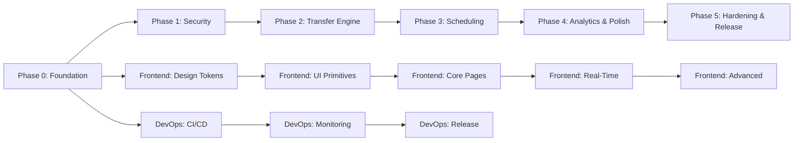

# File Flux — Master Implementation Plan

**Date:** February 12, 2026  
**Goal:** Build an enterprise-grade self-hosted Managed File Transfer (MFT) platform comparable to Stonebranch, enabling N-to-M file transfer job orchestration for mid-market enterprises.

---

## Executive Summary

File Flux already has a working prototype with a Go backend, Lit Web Components frontend, and a Go agent. However, the codebase has critical issues (auth bypass, in-memory file buffering, dead code paths, broken imports) that must be resolved before building enterprise features.

**Total estimated effort: 18–24 weeks** across 5 phases.

### Current State Assessment

| Component | Status | Key Issues |
|-----------|--------|-----------|
| **Backend** | Prototype | Auth bypass (hardcoded), 10MB file limit, 3 incompatible code paths, no scheduler |
| **Frontend** | Demo-ready | Monolithic app.ts (507 lines), no real-time updates, basic components |
| **Agent** | Stub | WebSocket connects, but transfer engine is empty, no chunking/compression |
| **Infrastructure** | Basic Docker Compose | No CI/CD, no monitoring, no TLS, no health checks |
| **Tests** | None | Zero tests across all components |

---

## Target Architecture

```
┌─────────────────────────────────────────────────────────────────────┐
│                        File Flux Platform                           │
├─────────────────────────────────────────────────────────────────────┤
│                                                                     │
│  ┌──────────────┐    ┌──────────────────────────────────────────┐   │
│  │   Frontend    │    │              Backend (Go)                │   │
│  │  (Lit/Vite)   │◄──►│                                          │   │
│  │              │ SSE │  ┌──────────┐  ┌──────────┐  ┌────────┐ │   │
│  │  Dashboard   │    │  │ REST API │  │ Event Bus│  │Scheduler│ │   │
│  │  Jobs        │    │  │(gorilla) │  │(in-proc) │  │(cron)  │ │   │
│  │  Agents      │    │  └────┬─────┘  └────┬─────┘  └───┬────┘ │   │
│  │  Transfers   │    │       │             │            │       │   │
│  │  Analytics   │    │  ┌────┴─────────────┴────────────┴────┐  │   │
│  │  Workflows   │    │  │        Transfer Engine              │  │   │
│  │  Admin       │    │  │  Chunker│Compressor│Hasher│Relay    │  │   │
│  └──────────────┘    │  └────────────────┬───────────────────┘  │   │
│                      │                   │ WebSocket             │   │
│                      │  ┌────────────────┴───────────────────┐  │   │
│                      │  │     WebSocket Manager              │  │   │
│                      │  │  (Agent connections, binary frames) │  │   │
│                      │  └────────────────┬───────────────────┘  │   │
│                      └──────────────────┬┴──────────────────────┘   │
│                                         │                           │
│                      ┌──────────────────┴──────────────────────┐    │
│                      │          PostgreSQL 16                  │    │
│                      │  users│agents│jobs│transfers│chunks│    │    │
│                      │  audit_log│webhooks│roles│api_keys     │    │
│                      └─────────────────────────────────────────┘    │
│                                                                     │
└─────────────────────────────────────────────────────────────────────┘
         ▲ WSS              ▲ WSS              ▲ WSS
         │                  │                  │
    ┌────┴────┐       ┌────┴────┐       ┌────┴────┐
    │ Agent 1 │       │ Agent 2 │       │ Agent N │
    │(Linux)  │       │(Windows)│       │(macOS)  │
    │ Push/Pull│      │ Push/Pull│      │ Push/Pull│
    └─────────┘       └─────────┘       └─────────┘
```

---

## Technology Stack

| Layer | Technology | Justification |
|-------|-----------|---------------|
| Backend | Go 1.22, gorilla/mux, raw SQL | Already in use, excellent for concurrent I/O and binary protocols |
| Database | PostgreSQL 16 | Already in use, rock-solid ACID, JSONB for flexible storage |
| Migrations | golang-migrate | Industry standard for Go projects |
| Frontend | Lit 3.x (Web Components), Vite | 7KB bundle (vs 40KB React), already in use, enterprise-friendly |
| Charts | Chart.js | ~25KB tree-shaken, works with Web Components |
| Agent | Go 1.22, Cobra CLI | Cross-platform, single binary, system service support |
| Compression | klauspost/compress (zstd), pierrec/lz4 | Enterprise-grade compression, 60-70% size reduction |
| Scheduling | robfig/cron/v3 | Mature, in-process, no external dependency |
| Logging | log/slog (stdlib) | Structured JSON logging, zero dependencies |
| Auth | golang-jwt/jwt/v5, bcrypt | Standard JWT, proven password hashing |
| CI/CD | GitHub Actions | Already on GitHub, excellent Go/Node support |
| Monitoring | Prometheus + Grafana | Industry standard, self-hosted friendly |
| TLS | Traefik (production) | Automatic Let's Encrypt, WebSocket support |

---

## Key Architecture Decisions (ADRs)

| # | Decision | Rationale |
|---|----------|-----------|
| ADR-001 | Consolidate on gorilla/mux + raw SQL; delete gin/GORM dead code | 3 code paths exist, only 1 should remain |
| ADR-002 | In-process event bus (no Kafka/RabbitMQ) | Self-hosted simplicity; pluggable `EventSink` interface allows adding external brokers later |
| ADR-003 | Backend relays chunk data (Phase 1); direct agent-to-agent later | Simpler to implement, works through firewalls |
| ADR-004 | Binary WebSocket frames for chunk data | 33% bandwidth savings vs base64 JSON |
| ADR-005 | SHA-256 integrity at chunk + whole-file level | Enterprise compliance requirement |
| ADR-006 | SSE for frontend real-time updates | Simpler than WebSocket for read-only event streams |
| ADR-007 | Keep Lit Web Components | 7KB vs 40KB React, already invested |
| ADR-008 | golang-migrate for DB migrations | Versioned, reversible, CI-checkable |
| ADR-009 | Structured logging with log/slog | Zero-dep stdlib, JSON output for log aggregation |
| ADR-010 | robfig/cron/v3 for scheduling | No external infrastructure needed |

---

## Phase Plan

### Phase 0: Foundation & Cleanup (Week 1–2)

**Owner: Go Backend Expert**

| # | Task | Days | Status |
|---|------|------|--------|
| 0.1 | Delete dead code (gin/GORM/Node.js/Stripe/Auth0) | 1 | ⬜ |
| 0.2 | Fix Go module path + all imports | 0.5 | ⬜ |
| 0.3 | Rewrite `cmd/server/main.go` as single entry point | 0.5 | ⬜ |
| 0.4 | Set up golang-migrate + initial migration | 1 | ⬜ |
| 0.5 | Restructure config (YAML + env vars) | 0.5 | ⬜ |
| 0.6 | Update go.mod (remove unused deps, add new) | 0.5 | ⬜ |
| 0.7 | Set up structured logging (slog) | 0.5 | ⬜ |
| 0.8 | Add health check endpoints (/health, /ready) | 0.5 | ⬜ |

**Frontend Expert (parallel):**

| # | Task | Days | Status |
|---|------|------|--------|
| 0.9 | Define CSS design tokens (~90 `--ff-*` properties) | 1 | ⬜ |
| 0.10 | Create TypeScript type definitions for all API types | 1 | ⬜ |
| 0.11 | Build API client service with error handling | 1 | ⬜ |
| 0.12 | Implement ReactiveStore pattern for state management | 1 | ⬜ |
| 0.13 | Build declarative router with lazy loading | 1 | ⬜ |

**DevOps Agent (parallel):**

| # | Task | Days | Status |
|---|------|------|--------|
| 0.14 | Create multi-stage Dockerfiles (backend, frontend, agent) | 1 | ⬜ |
| 0.15 | Update docker-compose.yml with health checks + network segmentation | 1 | ⬜ |
| 0.16 | Create .env.example with all variables | 0.5 | ⬜ |
| 0.17 | Set up GitHub Actions CI pipeline | 1 | ⬜ |
| 0.18 | Create root Makefile (build/test/lint/docker) | 0.5 | ⬜ |

---

### Phase 1: Security & Core Services (Week 3–4)

**Owner: Go Backend Expert**

| # | Task | Days | Status |
|---|------|------|--------|
| 1.1 | Fix token validation (actual DB lookup) | 0.5 | ⬜ |
| 1.2 | Rewrite JWT auth middleware | 1 | ⬜ |
| 1.3 | Implement RBAC (admin/operator/viewer roles) | 1.5 | ⬜ |
| 1.4 | Create audit logging service | 1 | ⬜ |
| 1.5 | Implement in-process event bus | 2 | ⬜ |
| 1.6 | Build SSE endpoint for frontend | 1 | ⬜ |
| 1.7 | Implement repository interfaces + PostgreSQL layer | 3 | ⬜ |
| 1.8 | Build API key authentication | 1 | ⬜ |

**Frontend Expert (parallel):**

| # | Task | Days | Status |
|---|------|------|--------|
| 1.9 | Build 25 shared UI primitives (data-table, modal, toast, etc.) | 8 | ⬜ |
| 1.10 | Rebuild login page with design tokens | 1 | ⬜ |
| 1.11 | Build app shell (sidebar, header, breadcrumbs) | 2 | ⬜ |

**Test Strategist (parallel):**

| # | Task | Days | Status |
|---|------|------|--------|
| 1.12 | Set up Go test infrastructure (mocks, helpers) | 1 | ⬜ |
| 1.13 | Set up frontend test infrastructure (Vitest, @open-wc/testing) | 1 | ⬜ |
| 1.14 | Write P0 auth & token validation tests | 2 | ⬜ |

---

### Phase 2: Transfer Engine (Week 5–8)

**Owner: Go Backend Expert + Go Agent Expert**

**Backend Transfer Engine:**

| # | Task | Days | Status |
|---|------|------|--------|
| 2.1 | Implement file chunker (split/reassemble) | 2 | ⬜ |
| 2.2 | Implement compressor interface (zstd + LZ4) | 1.5 | ⬜ |
| 2.3 | Implement SHA-256 hasher (chunk + whole-file) | 1 | ⬜ |
| 2.4 | Build binary WebSocket protocol (encode/decode frames) | 2 | ⬜ |
| 2.5 | Implement transfer relay (source → backend → destination) | 3 | ⬜ |
| 2.6 | Build transfer state management (in-flight tracking) | 2 | ⬜ |
| 2.7 | Implement transfer repository (chunks table) | 1.5 | ⬜ |
| 2.8 | Build TransferEngine orchestrator | 2 | ⬜ |

**Agent Transfer Engine (parallel):**

| # | Task | Days | Status |
|---|------|------|--------|
| 2.9 | Implement agent chunker + compressor + hasher | 3 | ⬜ |
| 2.10 | Build push mode (read file → chunk → compress → send) | 3 | ⬜ |
| 2.11 | Build pull mode (receive chunks → decompress → assemble) | 2 | ⬜ |
| 2.12 | Implement resume logic (state files + chunk tracking) | 2 | ⬜ |
| 2.13 | Add retry with exponential backoff | 1 | ⬜ |
| 2.14 | Implement file watcher (fsnotify + glob patterns) | 2 | ⬜ |

**Frontend (parallel):**

| # | Task | Days | Status |
|---|------|------|--------|
| 2.15 | Rebuild all core pages using shared primitives | 8 | ⬜ |
| 2.16 | Implement SSE client with typed event handlers | 2 | ⬜ |
| 2.17 | Build real-time transfer progress components | 2 | ⬜ |
| 2.18 | Build live dashboard with activity stream | 3 | ⬜ |

---

### Phase 3: Job Scheduling & Management (Week 9–12)

**Owner: Go Backend Expert**

| # | Task | Days | Status |
|---|------|------|--------|
| 3.1 | Implement cron scheduler (robfig/cron integration) | 3 | ⬜ |
| 3.2 | Build retry policies with exponential backoff | 1.5 | ⬜ |
| 3.3 | Implement job groups + agent groups | 2 | ⬜ |
| 3.4 | Build webhook delivery system (EventSink) | 3 | ⬜ |
| 3.5 | Implement notification rules | 2 | ⬜ |
| 3.6 | Add remaining API endpoints (users, API keys, webhooks, audit) | 4 | ⬜ |

**Agent (parallel):**

| # | Task | Days | Status |
|---|------|------|--------|
| 3.7 | Implement Cobra CLI (8 subcommands) | 2 | ⬜ |
| 3.8 | Build service installers (systemd/launchd/Windows Service) | 3 | ⬜ |
| 3.9 | Add post-transfer actions (delete/move/archive) | 1 | ⬜ |
| 3.10 | Implement agent auto-update mechanism | 2 | ⬜ |

**Frontend (parallel):**

| # | Task | Days | Status |
|---|------|------|--------|
| 3.11 | Build visual cron schedule builder | 3 | ⬜ |
| 3.12 | Build job builder (source → destination flow) | 3 | ⬜ |
| 3.13 | Build agent registration wizard + install script generator | 2 | ⬜ |
| 3.14 | Build webhook configuration UI | 1.5 | ⬜ |
| 3.15 | Build user management + RBAC UI | 2 | ⬜ |
| 3.16 | Build audit log viewer | 1.5 | ⬜ |

---

### Phase 4: Analytics, Workflows & Polish (Week 13–18)

**Owner: Frontend Expert**

| # | Task | Days | Status |
|---|------|------|--------|
| 4.1 | Build analytics charts (throughput, volume, success rates) | 4 | ⬜ |
| 4.2 | Build reporting page with CSV/PDF export | 3 | ⬜ |
| 4.3 | Build visual workflow/pipeline editor (drag-and-drop) | 8 | ⬜ |
| 4.4 | Implement dark mode | 2 | ⬜ |
| 4.5 | Add keyboard shortcuts + global search | 2 | ⬜ |
| 4.6 | Accessibility audit + fixes | 2 | ⬜ |
| 4.7 | Empty states, loading skeletons, confirmation dialogs | 2 | ⬜ |

**Backend (parallel):**

| # | Task | Days | Status |
|---|------|------|--------|
| 4.8 | Implement Prometheus metrics endpoint | 2 | ⬜ |
| 4.9 | Build workflow/pipeline execution engine | 5 | ⬜ |
| 4.10 | Performance tuning (connection pooling, query optimization) | 3 | ⬜ |

**DevOps (parallel):**

| # | Task | Days | Status |
|---|------|------|--------|
| 4.11 | Create production docker-compose with Traefik + TLS | 1 | ⬜ |
| 4.12 | Build Grafana dashboards (pre-provisioned) | 1.5 | ⬜ |
| 4.13 | Create Helm chart for Kubernetes | 3 | ⬜ |
| 4.14 | Build GitHub Actions release workflow (agent binaries + Docker) | 1.5 | ⬜ |
| 4.15 | Agent cross-compilation + checksums | 1 | ⬜ |

**Test Strategist (parallel):**

| # | Task | Days | Status |
|---|------|------|--------|
| 4.16 | Integration tests (testcontainers + PostgreSQL) | 4 | ⬜ |
| 4.17 | E2E tests (Playwright, critical flows) | 3 | ⬜ |
| 4.18 | Transfer engine tests (chunking, compression, resume) | 3 | ⬜ |
| 4.19 | Performance benchmarks (transfer throughput) | 2 | ⬜ |
| 4.20 | WebSocket protocol contract tests | 2 | ⬜ |

---

### Phase 5: Hardening & Release (Week 19–24)

| # | Task | Owner | Days | Status |
|---|------|-------|------|--------|
| 5.1 | Security audit | Architecture Reviewer | 3 | ⬜ |
| 5.2 | Code review (all components) | Code Reviewer | 5 | ⬜ |
| 5.3 | Load testing (100+ agents, large files) | Test Strategist | 3 | ⬜ |
| 5.4 | Documentation (user guide, API docs, admin guide) | All | 5 | ⬜ |
| 5.5 | Install script testing (all platforms) | DevOps Agent | 2 | ⬜ |
| 5.6 | Bug fixes from testing | All | 5 | ⬜ |
| 5.7 | Release preparation (changelog, versioning) | DevOps Agent | 1 | ⬜ |
| 5.8 | v1.0.0 release | All | 1 | ⬜ |

---

## Database Schema (Target)

### Existing Tables (Enhanced)
- `users` — added `updated_at`
- `agents` — added `group_id`, `updated_at`
- `tokens` — unchanged
- `jobs` — added `group_id`, `max_retries`, `retry_backoff_sec`, `updated_at`
- `transfers` — added `file_hash`, `compression`, `chunk_size`, `total_chunks`, `completed_chunks`, `bytes_transferred`, `retry_count`, `max_retries`

### New Tables (13)
| Table | Purpose |
|-------|---------|
| `roles` | RBAC role definitions (admin, operator, viewer) |
| `user_roles` | User-to-role assignments |
| `api_keys` | Service-to-service authentication |
| `audit_log` | Immutable audit trail for compliance |
| `agent_groups` | Logical grouping of agents |
| `agent_group_members` | Agent-to-group assignments |
| `job_groups` | Logical grouping of jobs |
| `transfer_chunks` | Per-chunk tracking (index, hash, status) |
| `domain_events` | Persisted event log |
| `webhooks` | Webhook endpoint configuration |
| `webhook_deliveries` | Webhook delivery tracking + retry |
| `notification_rules` | Event-to-notification routing |
| `schedules` | Cron schedule definitions |

---

## API Endpoints (Target: ~40+ endpoints)

### Core
| Method | Path | Description |
|--------|------|-------------|
| POST | /api/auth/login | Login |
| POST | /api/auth/refresh | Refresh JWT |
| GET | /api/auth/me | Current user |

### Agents & Groups
| Method | Path | Description |
|--------|------|-------------|
| GET/POST | /api/agents | List / Create agents |
| GET/PUT/DELETE | /api/agents/{id} | CRUD single agent |
| POST | /api/agents/{id}/test | Test connectivity |
| GET/POST | /api/agent-groups | List / Create groups |
| PUT/DELETE | /api/agent-groups/{id} | CRUD single group |

### Jobs & Groups
| Method | Path | Description |
|--------|------|-------------|
| GET/POST | /api/jobs | List / Create jobs |
| GET/PUT/DELETE | /api/jobs/{id} | CRUD single job |
| POST | /api/jobs/{id}/run | Trigger job now |
| POST | /api/jobs/{id}/schedule | Set cron schedule |
| GET/POST | /api/job-groups | List / Create groups |

### Transfers
| Method | Path | Description |
|--------|------|-------------|
| GET | /api/transfers | List transfers (paginated) |
| GET | /api/transfers/{id} | Transfer detail + chunks |
| POST | /api/transfers/{id}/cancel | Cancel transfer |
| POST | /api/transfers/{id}/resume | Resume failed transfer |

### Administration
| Method | Path | Description |
|--------|------|-------------|
| GET | /api/users | List users (admin) |
| PUT | /api/users/{id}/role | Assign role (admin) |
| GET/POST | /api/tokens | Token management |
| GET/POST | /api/api-keys | API key management |
| GET/POST | /api/webhooks | Webhook configuration |
| GET | /api/audit-log | Audit log queries |

### Dashboard & Events
| Method | Path | Description |
|--------|------|-------------|
| GET | /api/dashboard/stats | Aggregate statistics |
| GET | /api/events/stream | SSE real-time stream |
| GET | /health | Service health check |
| GET | /ready | Service readiness check |
| GET | /metrics | Prometheus metrics |

---

## Agent Distribution

### Build Targets
| OS | Arch | Binary Name |
|----|------|------------|
| Linux | amd64 | `fileflux-agent-linux-amd64` |
| Linux | arm64 | `fileflux-agent-linux-arm64` |
| macOS | amd64 | `fileflux-agent-darwin-amd64` |
| macOS | arm64 | `fileflux-agent-darwin-arm64` |
| Windows | amd64 | `fileflux-agent-windows-amd64.exe` |

### CLI Commands
```
fileflux-agent start             # Start (foreground)
fileflux-agent install           # Install as system service
fileflux-agent uninstall         # Remove system service
fileflux-agent status            # Show agent status
fileflux-agent test-connection   # Test backend connectivity
fileflux-agent version           # Show version
fileflux-agent config validate   # Validate config file
fileflux-agent config init       # Generate default config
```

---

## Agent Routing Matrix

| Task Type | Primary Agent | Supporting Agent |
|-----------|--------------|-----------------|
| Architecture design | Lead Architect | Architecture Reviewer |
| Backend Go code | Go Backend Expert | Code Reviewer |
| Agent Go code | Go Agent Expert | Code Reviewer |
| Frontend TypeScript | Frontend Expert | Code Reviewer |
| CI/CD & Docker | DevOps Agent | Go Backend Expert |
| Testing | Test Strategist | All |
| Code review | Code Reviewer | Architecture Reviewer |

---

## Critical Path



---

## Risk Assessment

| Risk | Impact | Probability | Mitigation |
|------|--------|-------------|------------|
| Auth bypass in production | Critical | Certain (exists now) | Phase 1 priority — fix immediately |
| Transfer engine complexity | High | Medium | Phase 2 has 2× buffer; relay-first approach simplifies |
| Cross-platform agent issues | Medium | Medium | CI tests on all 3 OS; use Go's cross-compilation |
| WebSocket binary protocol bugs | High | Medium | Contract tests + table-driven test suites |
| Frontend component count | Low | Low | Lit's simplicity + shared primitives reduce per-component effort |
| PostgreSQL at scale | Medium | Low | Connection pooling, query optimization in Phase 4 |

---

## Success Metrics

| Metric | Target |
|--------|--------|
| Transfer throughput | > 100 MB/s (local network) |
| Compression ratio | > 60% (zstd, typical files) |
| Agent reconnect time | < 10s after disconnect |
| Dashboard load time | < 2s |
| Frontend bundle size | < 80KB gzipped |
| API response time (p95) | < 200ms |
| Test coverage (backend) | > 80% |
| Test coverage (frontend) | > 70% |
| Concurrent agents | > 100 |
| Max file size | > 10 GB |

---

## Deployment Options

1. **Quick Start**: `docker compose up` — PostgreSQL + backend + frontend
2. **Production**: `docker compose -f docker-compose.yml -f docker-compose.production.yml up` — adds Traefik TLS, Prometheus, Grafana
3. **Kubernetes**: Helm chart at `deploy/helm/fileflux/`
4. **Single Binary**: Backend can run standalone with external PostgreSQL

---

## Next Steps

1. **Immediate**: Start Phase 0 — clean up dead code, fix imports, set up migrations
2. **Week 1**: Parallel tracks — backend cleanup, frontend design tokens, CI/CD setup
3. **Week 3**: Phase 1 — fix auth bypass (critical security), build UI primitives
4. **Week 5**: Phase 2 — transfer engine (the core value proposition)

The platform will be built incrementally, with each phase producing a deployable, testable artifact. No big-bang releases — continuous integration from day 1.
