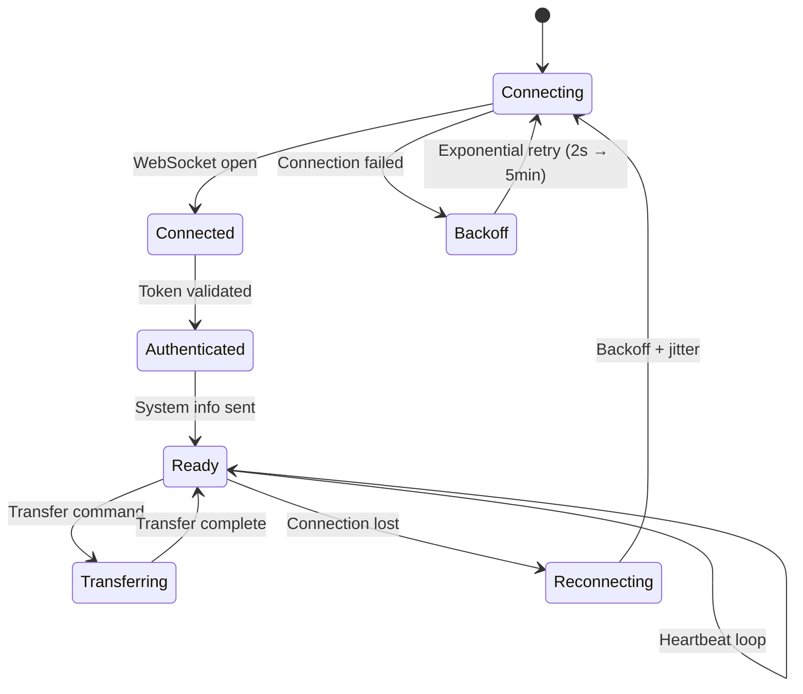

# Agent Architecture

The FileFlux agent is a standalone Go binary that runs on endpoint machines.

## Component Structure

```
agent/
├── cmd/agent/main.go       # Entry point, signal handling
├── internal/
│   ├── config/             # YAML configuration (config.go)
│   ├── transport/          # Transport abstraction layer
│   │   ├── transport.go    # Transport interface
│   │   ├── ws_transport.go # WebSocket transport (primary)
│   │   ├── polling_transport.go  # HTTP Long-Polling (fallback)
│   │   └── auto_transport.go     # Auto-detect best transport
│   ├── engine/             # Transfer engine (Phase 2)
│   │   ├── chunker/        # File splitting / reassembly
│   │   ├── compress/       # Compression (zstd, LZ4, none)
│   │   ├── hasher/         # SHA-256 integrity hashing
│   │   └── protocol/       # Binary WebSocket frame codec
│   ├── transfer/           # File upload/download, chunking
│   ├── api/                # HTTP client for file transfer API
│   └── system/             # System info collection (OS, IP, hostname)
└── go.mod
```

## Startup Flow

```
main.go
  ├── config.LoadConfig()         # YAML laden
  ├── system.CollectSystemInfo()  # OS, Hostname, IP
  ├── api.NewClient()             # HTTP-Client für File-API
  ├── transfer.NewManager()       # Transfer-Engine
  ├── websocket.NewClient()       # WS-Client erstellen
  │     ├── SetSystemInfo()
  │     └── SetTransferManager()
  └── go wsClient.Connect()       # Verbindung in Goroutine
```

## Connection Management



Der Agent nutzt **unbegrenztes exponentielles Backoff mit Jitter** (2 Sekunden bis maximal 5 Minuten) und startet sich nach Verbindungsverlust automatisch neu.

## Transfer Engine

1. **Chunk-basiert** — Dateien werden in konfigurierbaren Chunks gelesen (Standard 8 MB)
2. **Binary WebSocket** — Chunks werden als 57-Byte-Header + komprimierte Payload über WebSocket gesendet (Phase 2, Protokoll `binary_ws`)
3. **HTTP-Upload (Legacy)** — Chunks werden als `PUT /api/files/{transferId}/upload` an den Server gesendet
4. **HTTP-Download** — Dateien werden via `GET /api/files/{transferId}/download` empfangen
5. **Kompression** — zstd (Standard) oder LZ4 Kompression pro Chunk
6. **Integrität** — SHA-256 Hash pro Chunk und für die gesamte Datei
7. **Progress-Reporting** — Fortschritt wird per WebSocket an den Server gemeldet
8. **Concurrency** — Mehrere Transfers können parallel laufen (konfigurierbar)
9. **Retry** — Exponentielles Backoff mit Jitter bei Chunk-Fehlern (max. 3 Versuche)

## Message Types

Der Agent verarbeitet folgende WebSocket-Nachrichten:

| Type | Richtung | Beschreibung |
|------|----------|-------------|
| `heartbeat` | Agent → Server | Regelmäßiger Lebenszeichen-Ping (alle 60s) |
| `agent_info` | Agent → Server | Systeminformationen senden |
| `transfer_request` | Server → Agent | Transfer starten |
| `transfer_progress` | Agent → Server | Fortschritt melden |
| `transfer_complete` | Agent → Server | Transfer abgeschlossen |
| `transfer_error` | Agent → Server | Fehler melden |
| `chunk_ack` | Bidirektional | Chunk erfolgreich empfangen |
| `chunk_nack` | Bidirektional | Chunk-Empfang fehlgeschlagen |
| `chunk_request` | Server → Agent | Bestimmten Chunk anfordern |
| `transfer_resume` | Server → Agent | Unterbrochenen Transfer fortsetzen |
| `cancel_transfer` | Server → Agent | Transfer abbrechen |
| `connection_test` | Server → Agent | Verbindungstest |

## Cross-Platform Support

Der Agent kompiliert zu einem einzelnen statischen Binary pro Plattform:

| Target | Binary |
|--------|--------|
| Linux amd64 | `fileflux-agent-linux-amd64` |
| Linux arm64 | `fileflux-agent-linux-arm64` |
| macOS amd64 | `fileflux-agent-darwin-amd64` |
| macOS arm64 | `fileflux-agent-darwin-arm64` |
| Windows amd64 | `fileflux-agent-windows-amd64.exe` |
