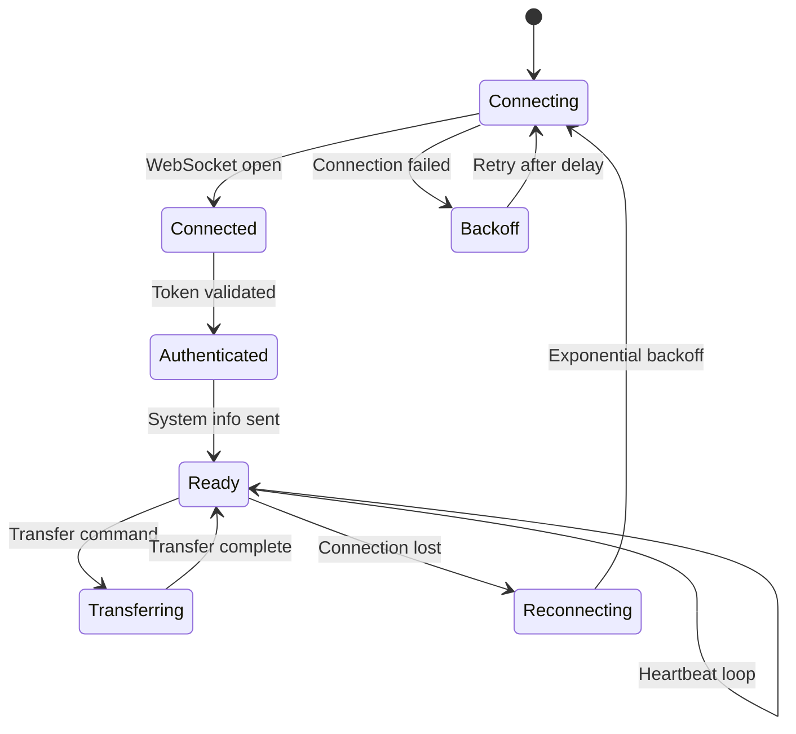

# Agent Architecture

The FileFlux agent is a standalone Go binary that runs on endpoint machines.

## Component Structure

```
agent/
├── cmd/agent/main.go       # Entry point, Cobra CLI
├── internal/
│   ├── config/             # YAML + env configuration
│   ├── connection/         # WebSocket client, reconnect logic
│   ├── transfer/           # File read/write, chunking
│   ├── checksum/           # SHA-256 computation
│   ├── system/             # System info collection
│   └── watcher/            # File system watcher (future)
└── go.mod
```

## CLI Commands

```bash
fileflux-agent              # Start agent (default)
fileflux-agent start        # Start agent with options
fileflux-agent init         # Generate config.yaml
fileflux-agent status       # Check connection status
fileflux-agent version      # Print version info
```

## Connection Management



## Transfer Engine

1. **Chunking** — Files are read in configurable chunks (default 1 MB)
2. **Binary frames** — Each chunk is sent as a binary WebSocket frame with a header containing transfer ID, chunk index, and chunk size
3. **Checksum** — SHA-256 is computed incrementally as chunks are read/written
4. **Concurrency** — Multiple transfers can run in parallel (configurable)

## Cross-Platform Support

The agent compiles to a single static binary per platform:

| Target | Binary |
|--------|--------|
| Linux amd64 | `fileflux-agent-linux-amd64` |
| Linux arm64 | `fileflux-agent-linux-arm64` |
| macOS amd64 | `fileflux-agent-darwin-amd64` |
| macOS arm64 | `fileflux-agent-darwin-arm64` |
| Windows amd64 | `fileflux-agent-windows-amd64.exe` |
