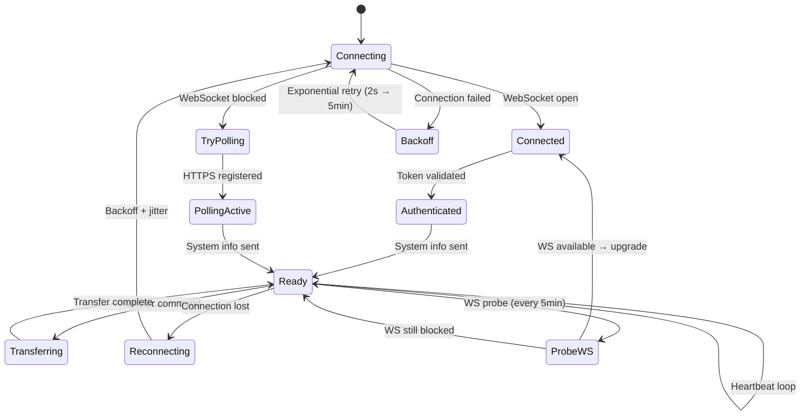

# Agent Architecture

The FileFlux agent is a standalone Go binary that runs on endpoint machines.

## Component Structure

```
agent/
├── cmd/agent/main.go       # Entry point, signal handling
├── internal/
│   ├── config/             # YAML configuration (config.go)
│   ├── transport/          # Transport abstraction layer
│   │   ├── transport.go    # Transport interface
│   │   ├── ws_transport.go # WebSocket transport (primary)
│   │   ├── polling_transport.go  # HTTP Long-Polling (fallback)
│   │   └── auto_transport.go     # Auto-detect best transport
│   ├── engine/             # Transfer engine (Phase 2)
│   │   ├── chunker/        # File splitting / reassembly
│   │   ├── compress/       # Compression (zstd, LZ4, none)
│   │   ├── hasher/         # SHA-256 integrity hashing
│   │   └── protocol/       # Binary WebSocket frame codec
│   ├── transfer/           # File upload/download, chunking
│   ├── api/                # HTTP client for file transfer API
│   └── system/             # System info collection (OS, IP, hostname)
└── go.mod
```

## Startup Flow

```
main.go
  ├── config.LoadConfig()         # Load YAML configuration
  ├── system.CollectSystemInfo()  # OS, hostname, IP
  ├── api.NewClient()             # HTTP client for file API
  ├── transfer.NewManager()       # Transfer engine
  ├── NewAutoTransport()          # Adaptive transport layer
  │     ├── Try WebSocket first
  │     └── Fallback to HTTPS polling
  └── go transport.Connect()      # Connect in goroutine
```

## Connection Management



The agent uses **unlimited exponential backoff with jitter** (2 seconds up to 5 minutes max) and automatically reconnects after connection loss. When running in polling mode, the agent periodically probes whether WebSocket has become available and upgrades transparently.

## Transfer Engine

| Capability | Description |
|-----------|-------------|
| **Chunk-based** | Files are split into configurable chunks (default 8 MB) for resumable transfers |
| **Binary WebSocket** | Chunks are sent as 57‑byte header + compressed payload via WebSocket (Phase 2, protocol `binary_ws`) |
| **HTTPS Upload** | Chunks can also be uploaded via `PUT /api/files/{transferId}/upload` over standard HTTPS |
| **HTTPS Download** | Files are downloaded via `GET /api/files/{transferId}/download` |
| **Compression** | zstd (default) or LZ4 compression per chunk — reducing bandwidth by up to 80% |
| **Integrity** | SHA-256 hash per chunk and for the entire file — cryptographic proof of correctness |
| **Progress Reporting** | Real-time progress updates sent to the backend (via WS or HTTPS) |
| **Concurrency** | Multiple transfers can run in parallel (configurable) |
| **Retry** | Exponential backoff with jitter on chunk errors (max 3 attempts) |

## Message Types

The agent processes the following messages (via WebSocket or HTTPS polling):

| Type | Direction | Description |
|------|-----------|-------------|
| `heartbeat` | Agent → Server | Keep-alive ping every 60s |
| `agent_info` | Agent → Server | Send system information |
| `transfer_request` | Server → Agent | Start a transfer |
| `transfer_progress` | Agent → Server | Report transfer progress |
| `transfer_complete` | Agent → Server | Transfer finished successfully |
| `transfer_error` | Agent → Server | Report transfer error |
| `chunk_ack` | Bidirectional | Chunk received successfully |
| `chunk_nack` | Bidirectional | Chunk reception failed |
| `chunk_request` | Server → Agent | Request a specific chunk |
| `transfer_resume` | Server → Agent | Resume interrupted transfer |
| `cancel_transfer` | Server → Agent | Cancel a transfer |
| `connection_test` | Server → Agent | Connectivity test |

## Cross-Platform Support

The agent compiles to a single static binary per platform — no runtime dependencies, no installation required:

| Target | Binary | Size |
|--------|--------|------|
| Linux amd64 | `fileflux-agent-linux-amd64` | ~15 MB |
| Linux arm64 | `fileflux-agent-linux-arm64` | ~15 MB |
| macOS amd64 | `fileflux-agent-darwin-amd64` | ~15 MB |
| macOS arm64 | `fileflux-agent-darwin-arm64` | ~15 MB |
| Windows amd64 | `fileflux-agent-windows-amd64.exe` | ~16 MB |
