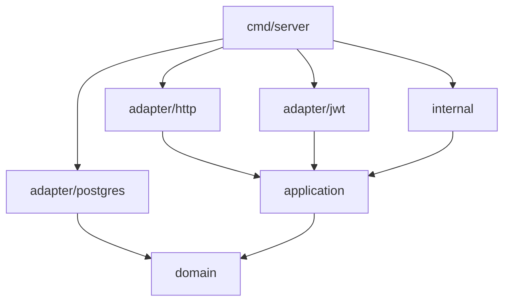

# Backend Architecture

The backend is a Go application following Clean Architecture principles with strict layer separation.

## Package Layout

```
backend/
├── cmd/server/main.go          # Entry point, DI wiring
├── domain/                     # Domain layer (entities, interfaces)
│   ├── agent/                  # Agent entity + repository interface
│   ├── common/                 # Shared errors (ErrNotFound, ErrValidation)
│   ├── job/                    # Job entity + repository interface
│   ├── transfer/               # Transfer entity + repository interface
│   ├── token/                  # Token entity + repository interface
│   └── user/                   # User entity + repository interface
├── application/                # Application layer (use cases / services)
│   ├── agent/                  # AgentService (CRUD, connection check)
│   ├── auth/                   # AuthService (login, register, password)
│   ├── job/                    # JobService (CRUD, Run, scheduler reload)
│   ├── scheduler/              # Cron-based job scheduler
│   ├── token/                  # TokenService (create, revoke, list)
│   └── transfer/               # TransferService (CRUD, cancel, progress)
├── adapter/                    # Interface adapters
│   ├── http/                   # REST handlers (router, handlers, helpers)
│   ├── jwt/                    # JWT token generation adapter
│   └── postgres/               # PostgreSQL repository implementations
├── internal/                   # Infrastructure
│   ├── config/                 # YAML + env configuration
│   ├── db/                     # Schema migration, SQL
    ├── dispatch/               # Hybrid dispatcher (WebSocket + HTTPS polling)
│   ├── engine/                 # Chunked transfer engine
│   │   ├── chunker/            # File splitting / reassembly
│   │   ├── compress/           # Compression (zstd, LZ4, none)
│   │   ├── hasher/             # SHA-256 integrity hashing
│   │   ├── protocol/           # Binary WebSocket frame codec
│   │   ├── relay/              # Disk-based chunk relay storage
│   │   └── state/              # In-memory transfer state tracker
│   ├── middleware/             # Auth, rate limiting, CORS, logging
│   └── websocket/              # WebSocket manager (agent connections)
└── go.mod
```

## Dependency Flow



Dependencies point **inward** — outer layers depend on inner layers, never the reverse.

## Key Interfaces

```go
// domain/agent/entity.go
type Repository interface {
    List(ctx context.Context) ([]Agent, error)
    GetByID(ctx context.Context, id int) (*Agent, error)
    Create(ctx context.Context, agent *Agent) error
    Update(ctx context.Context, agent *Agent) error
    UpdateInfo(ctx context.Context, id int, system, ipAddress, version string) error
    UpdateStatus(ctx context.Context, id int, status string) error
    UpdateTransportMode(ctx context.Context, id int, mode string) error
    UpdateLastPoll(ctx context.Context, id int) error
    Delete(ctx context.Context, id int) error
}

// domain/job/entity.go
type Repository interface {
    ListByUser(ctx context.Context, userID int) ([]Job, error)
    GetByID(ctx context.Context, id int) (*Job, error)
    Create(ctx context.Context, job *Job) error
    Update(ctx context.Context, job *Job) error
    Delete(ctx context.Context, id int) error
    ListActive(ctx context.Context) ([]Job, error)
    CountByUser(ctx context.Context, userID int) (int, error)
}

// domain/transfer/entity.go
type Repository interface {
    ListByUser(ctx context.Context, userID int) ([]Transfer, error)
    GetByID(ctx context.Context, id int) (*Transfer, error)
    GetByIDForUser(ctx context.Context, id, userID int) (*Transfer, error)
    Create(ctx context.Context, transfer *Transfer) error
    UpdateStatus(ctx context.Context, id int, status Status, errorMsg string) error
    UpdateProgress(ctx context.Context, id int, progress float64) error
    UpdateChunkProgress(ctx context.Context, id int, completedChunks int, bytesTransferred int64) error
    UpdateFileHash(ctx context.Context, id int, hash string) error
}

// domain/transfer/entity.go — Phase 2
type ChunkRepository interface {
    CreateChunks(ctx context.Context, transferID int, totalChunks int) error
    MarkChunkReceived(ctx context.Context, transferID int, chunkIndex int, hash string, compressedSize, originalSize int) error
    GetChunkStatus(ctx context.Context, transferID int) ([]ChunkStatus, error)
    GetPendingChunks(ctx context.Context, transferID int) ([]int, error)
    GetCompletedCount(ctx context.Context, transferID int) (int, error)
}
```

## Technology Stack

| Component | Library | Purpose |
|-----------|---------|---------|
| HTTP Router | gorilla/mux | REST API routing |
| WebSocket | gorilla/websocket | Real-time agent communication (primary transport) |
| HTTPS Polling | gorilla/mux | Agent communication fallback for restricted networks |
| Database | database/sql + lib/pq | PostgreSQL driver |
| JWT | golang-jwt/jwt/v5 | Token generation + validation |
| Scheduling | robfig/cron/v3 | Job scheduling |
| Config | gopkg.in/yaml.v2 | YAML configuration |
| Password Hashing | golang.org/x/crypto/bcrypt | Secure password storage |
| Compression (zstd) | klauspost/compress | Fast zstd compression for chunk transfer |
| Compression (LZ4) | pierrec/lz4/v4 | Ultra-fast LZ4 compression alternative |

## ADRs

See [Architecture Decision Records](../development/adrs.md) for all decisions and rationale.
