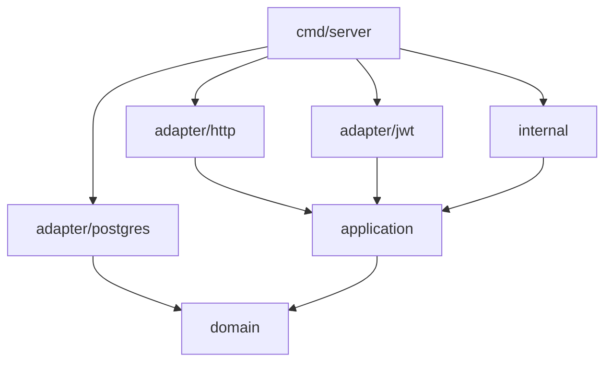

# Backend Architecture

The backend is a Go application following Clean Architecture principles with strict layer separation.

## Package Layout

```
backend/
├── cmd/server/main.go          # Entry point, DI wiring
├── domain/                     # Domain layer (entities, interfaces)
│   ├── agent/                  # Agent entity + repository interface
│   ├── common/                 # Shared errors (ErrNotFound, ErrValidation)
│   ├── job/                    # Job entity + repository interface
│   ├── transfer/               # Transfer entity + repository interface
│   ├── token/                  # Token entity + repository interface
│   └── user/                   # User entity + repository interface
├── application/                # Application layer (use cases / services)
│   ├── agent/                  # AgentService (CRUD, connection check)
│   ├── auth/                   # AuthService (login, register, password)
│   ├── job/                    # JobService (CRUD, Run, scheduler reload)
│   ├── scheduler/              # Cron-based job scheduler
│   ├── token/                  # TokenService (create, revoke, list)
│   └── transfer/               # TransferService (CRUD, cancel, progress)
├── adapter/                    # Interface adapters
│   ├── http/                   # REST handlers (router, handlers, helpers)
│   ├── jwt/                    # JWT token generation adapter
│   └── postgres/               # PostgreSQL repository implementations
├── internal/                   # Infrastructure (being migrated)
│   ├── config/                 # YAML + env configuration
│   ├── db/                     # Schema migration, SQL
│   ├── middleware/             # Auth, rate limiting, CORS, logging
│   └── websocket/              # WebSocket manager (agent connections)
└── go.mod
```

## Dependency Flow



Dependencies point **inward** — outer layers depend on inner layers, never the reverse.

## Key Interfaces

```go
// domain/agent/entity.go
type Repository interface {
    ListByUser(ctx context.Context, userID int) ([]Agent, error)
    GetByID(ctx context.Context, id int) (*Agent, error)
    Create(ctx context.Context, agent *Agent) error
    Update(ctx context.Context, agent *Agent) error
    Delete(ctx context.Context, id int) error
    UpdateStatus(ctx context.Context, id int, status string) error
    UpdateInfo(ctx context.Context, id int, system, ip, version string) error
}

// domain/job/entity.go
type Repository interface {
    ListByUser(ctx context.Context, userID int) ([]Job, error)
    GetByID(ctx context.Context, id int) (*Job, error)
    Create(ctx context.Context, job *Job) error
    Update(ctx context.Context, job *Job) error
    Delete(ctx context.Context, id int) error
    ListActive(ctx context.Context) ([]Job, error)
    CountByUser(ctx context.Context, userID int) (int, error)
}

// domain/transfer/entity.go
type Repository interface {
    ListByUser(ctx context.Context, userID int) ([]Transfer, error)
    GetByID(ctx context.Context, id int) (*Transfer, error)
    GetByIDForUser(ctx context.Context, id, userID int) (*Transfer, error)
    Create(ctx context.Context, transfer *Transfer) error
    UpdateStatus(ctx context.Context, id int, status Status, errorMsg string) error
    UpdateProgress(ctx context.Context, id int, progress float64) error
}
```

## Technology Stack

| Component | Library | Purpose |
|-----------|---------|---------|
| HTTP Router | gorilla/mux | REST API routing |
| WebSocket | gorilla/websocket | Agent communication |
| Database | database/sql + lib/pq | PostgreSQL driver |
| JWT | golang-jwt/jwt/v5 | Token generation + validation |
| Scheduling | robfig/cron/v3 | Job scheduling |
| Config | gopkg.in/yaml.v2 | YAML configuration |
| Password Hashing | golang.org/x/crypto/bcrypt | Secure password storage |

## ADRs

See [Architecture Decision Records](../development/adrs.md) for all decisions and rationale.
