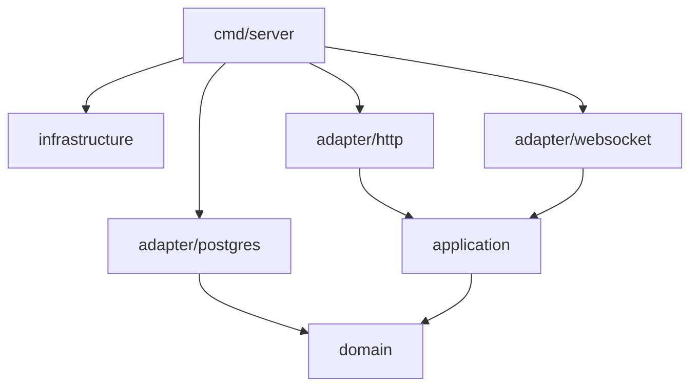

# Backend Architecture

The backend is a Go application following Clean Architecture principles.

## Package Layout

```
backend/
├── cmd/server/main.go          # Entry point, DI wiring
├── internal/
│   ├── domain/                 # Domain layer (entities, interfaces)
│   │   ├── agent.go
│   │   ├── job.go
│   │   ├── transfer.go
│   │   ├── user.go
│   │   └── token.go
│   ├── application/            # Application layer (use cases)
│   │   ├── job_service.go
│   │   ├── transfer_service.go
│   │   ├── agent_service.go
│   │   └── auth_service.go
│   ├── adapter/                # Interface adapters
│   │   ├── http/               # REST handlers
│   │   ├── websocket/          # WebSocket handlers
│   │   ├── postgres/           # Repository implementations
│   │   └── sse/                # SSE broadcaster
│   └── infrastructure/         # Frameworks & drivers
│       ├── config/
│       ├── logging/
│       ├── migration/
│       └── scheduler/
└── go.mod
```

## Dependency Flow



Dependencies point **inward** — outer layers depend on inner layers, never the reverse.

## Key Interfaces

```go
// domain/repository.go
type AgentRepository interface {
    FindByID(ctx context.Context, id int64) (*Agent, error)
    FindAll(ctx context.Context) ([]Agent, error)
    Create(ctx context.Context, agent *Agent) error
    UpdateStatus(ctx context.Context, id int64, status string) error
}

type JobRepository interface {
    FindByID(ctx context.Context, id int64) (*Job, error)
    FindAll(ctx context.Context, filter JobFilter) ([]Job, error)
    Create(ctx context.Context, job *Job) error
    Update(ctx context.Context, job *Job) error
    Delete(ctx context.Context, id int64) error
}

type TransferRepository interface {
    FindByID(ctx context.Context, id int64) (*Transfer, error)
    FindByJobID(ctx context.Context, jobID int64) ([]Transfer, error)
    Create(ctx context.Context, transfer *Transfer) error
    UpdateStatus(ctx context.Context, id int64, status string) error
    UpdateProgress(ctx context.Context, id int64, progress float64) error
}
```

## Technology Stack

| Component | Library | Purpose |
|-----------|---------|---------|
| HTTP Router | gorilla/mux | REST API routing |
| WebSocket | gorilla/websocket | Agent communication |
| Database | database/sql + lib/pq | PostgreSQL driver |
| Migrations | golang-migrate | Schema versioning |
| Logging | log/slog | Structured logging |
| Scheduling | robfig/cron/v3 | Job scheduling |
| Config | yaml.v3 + envconfig | Configuration |

## ADRs

See [Architecture Decision Records](../development/adrs.md) for all decisions and rationale.
