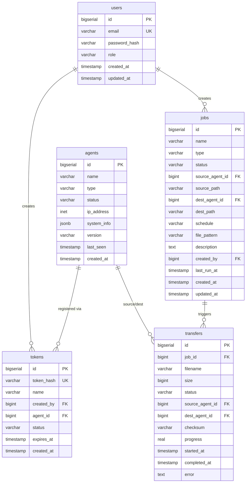

# Database Schema

FileFlux uses PostgreSQL 14+ with schema migrations managed by `golang-migrate`.

## Entity Relationship Diagram



## Migrations

Migrations are stored in `backend/migrations/` and applied automatically on startup:

```bash
# Apply all pending migrations
just db-migrate

# Reset database (destroys data!)
just db-reset
```

## Indexes

Key indexes for query performance:

- `transfers(job_id)` — Fast lookup by job
- `transfers(status)` — Filter by status
- `agents(status)` — Active agent queries
- `tokens(token_hash)` — Token validation
- `jobs(source_agent_id, dest_agent_id)` — Agent relationship queries
