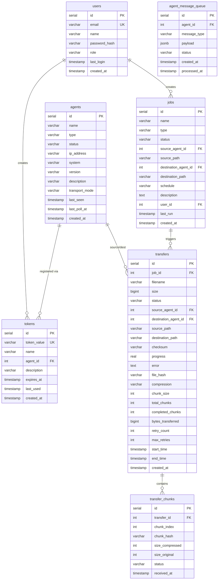

# Database Schema

FileFlux uses PostgreSQL 16 with auto-migration from `backend/internal/db/schema.sql`.

## Entity Relationship Diagram



## Migrations

Schema is defined in `backend/internal/db/schema.sql` and applied automatically on startup via `pgDB.Migrate()`. All DDL statements use `IF NOT EXISTS` / `IF NOT EXISTS` for idempotent re-runs.

```bash
# Reset database (destroys data!)
just db-reset
```

## Indexes

Key indexes for query performance:

- `transfers(job_id)` — Fast lookup by job
- `transfers(status)` — Filter by status
- `agents(status)` — Active agent queries
- `tokens(token_value)` — Token validation
- `jobs(source_agent_id, destination_agent_id)` — Agent relationship queries
- `transfer_chunks(transfer_id)` — Chunk lookup by transfer
- `agent_message_queue(agent_id, status)` — Pending message lookup
