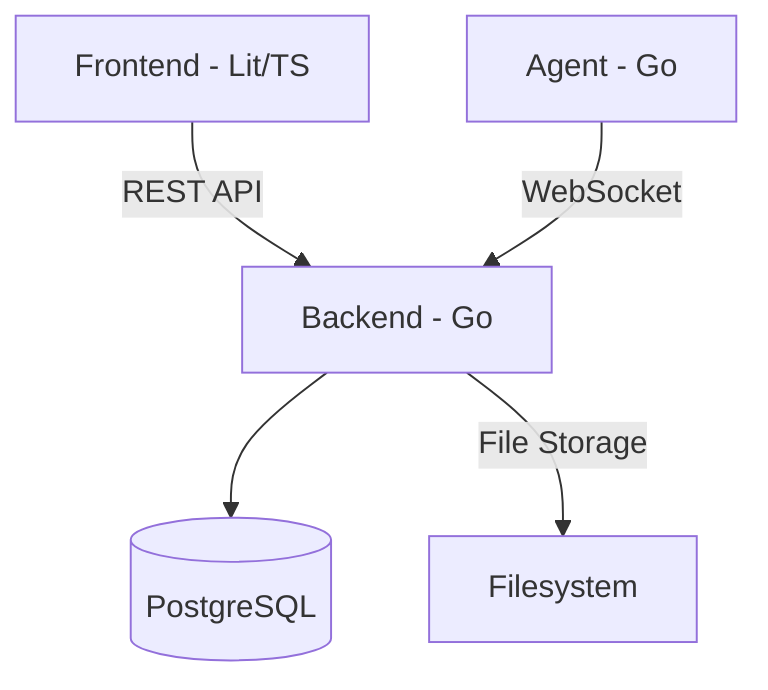

# Architecture

FileFlux folgt dem Clean-Architecture-Ansatz: klare Schichtentrennung, Dependency Inversion und ein domänengetriebenes Design. Dieser Abschnitt beschreibt das Zusammenspiel aller Komponenten.

- :material-arrange-bring-forward: **[System Overview](overview.md)** — Gesamtarchitektur und Kommunikationsmuster
- :material-language-go: **[Backend](backend.md)** — Go Clean Architecture, Services und Repositories
- :material-language-typescript: **[Frontend](frontend.md)** — Lit Web Components und Design System
- :material-monitor: **[Agent](agent.md)** — Standalone Go-Binary mit WebSocket-Verbindung
- :material-websocket: **[WebSocket Protocol](websocket-protocol.md)** — Binary-Protokoll und Nachrichtentypen
- :material-database: **[Database](database.md)** — PostgreSQL-Schema und ERD

## Schichtenmodell

