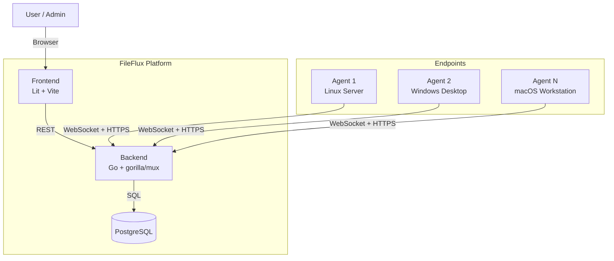
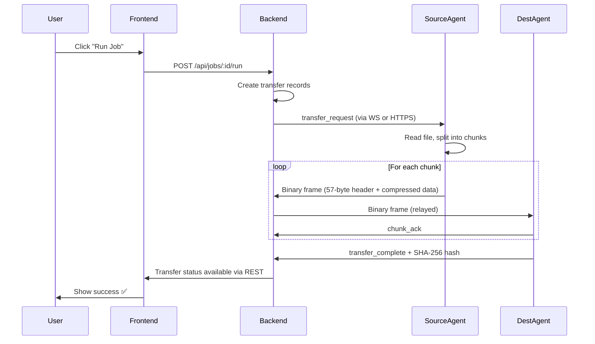

# System Overview

FileFlux follows a hub-and-spoke architecture where the backend acts as the central coordinator.

## High-Level Architecture

!!! tip "Dual Transport"
    Every agent connects via **WebSocket** for low-latency real-time communication. In networks where firewalls or proxies block WebSocket upgrades, agents **automatically fall back to HTTPS Long-Polling** — ensuring reliable connectivity in any enterprise environment.

## Component Responsibilities

| Component | Technology | Responsibility |
|-----------|-----------|----------------|
| **Backend** | Go, gorilla/mux | API server, WebSocket hub, job scheduling, transfer coordination |
| **Frontend** | Lit, TypeScript, Vite | Web UI for management and monitoring |
| **Agent** | Go, flag (stdlib) | Endpoint process for file operations |
| **Database** | PostgreSQL 16 | Persistent storage for all state |

## Communication Patterns

| Path | Protocol | Purpose |
|------|----------|---------|
| Frontend → Backend | REST over HTTPS | CRUD operations, authentication |
| Backend → Frontend | REST (Polling) | Transfer updates, agent status |
| Agent ↔ Backend | **WebSocket** (primary) | Real-time command & control, heartbeat, file transfer |
| Agent ↔ Backend | **HTTPS Long-Polling** (fallback) | Automatic fallback for restricted networks |
| Agent ↔ Backend | WebSocket (binary frames) | Chunked file transfer with zstd/LZ4 compression |

### Adaptive Transport — Zero Configuration

Agents use **auto-detection** by default (`transport_mode: auto`):

1. Attempt WebSocket connection (low-latency, bidirectional)
2. If blocked → seamless fallback to HTTPS Long-Polling
3. Background probe every 5 minutes → auto-upgrade back to WebSocket

This ensures **zero-touch deployment** in any network environment — from open dev setups to locked-down corporate networks behind proxies.

## Data Flow: File Transfer

!!! note "Transport-Agnostic"
    The transfer flow works identically regardless of whether agents are connected via WebSocket or HTTPS polling. The backend's dispatcher layer abstracts the transport — agents receive commands and deliver data through whichever channel is available.

## Design Principles

| Principle | What It Means |
|-----------|---------------|
| **Backend as Relay** | All file data flows through the backend. Agents never communicate directly — ensuring full audit trails and centralized monitoring. |
| **Dual Transport** | Agents connect via WebSocket (primary) or HTTPS Long-Polling (fallback). Transport is auto-detected — zero manual configuration. |
| **Stateless Agents** | Agents hold no persistent state. All state lives in PostgreSQL — making agents disposable and easy to redeploy. |
| **Chunked + Compressed** | Files are split into 8 MB chunks with zstd/LZ4 compression and per-chunk SHA-256 verification — enabling resumable, integrity-verified transfers. |
| **Event-Driven** | Internal event bus decouples components — making the system extensible and testable. |
| **Interface-Based** | All external dependencies are behind Go interfaces — enabling thorough unit testing without infrastructure. |
