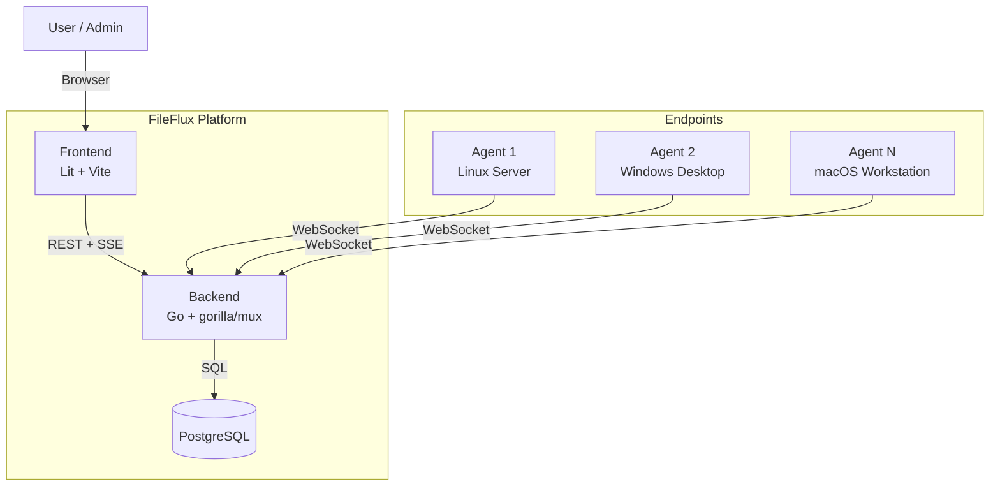
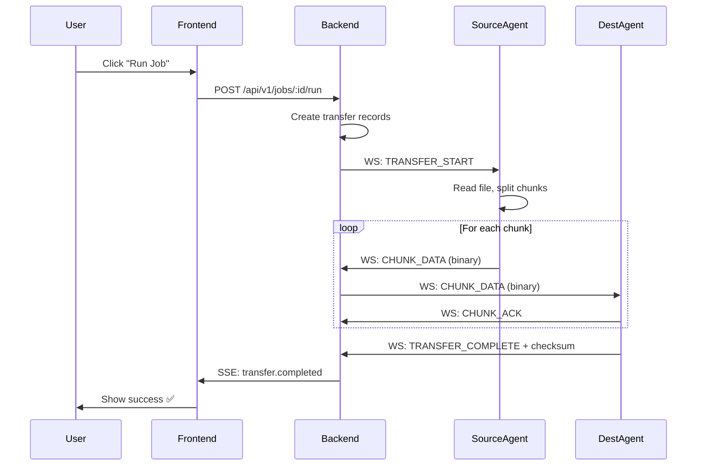

# System Overview

FileFlux follows a hub-and-spoke architecture where the backend acts as the central coordinator.

## High-Level Architecture

## Component Responsibilities

| Component | Technology | Responsibility |
|-----------|-----------|----------------|
| **Backend** | Go, gorilla/mux | API server, WebSocket hub, job scheduling, transfer coordination |
| **Frontend** | Lit, TypeScript, Vite | Web UI for management and monitoring |
| **Agent** | Go, Cobra CLI | Endpoint process for file operations |
| **Database** | PostgreSQL 14+ | Persistent storage for all state |

## Communication Patterns

| Path | Protocol | Purpose |
|------|----------|---------|
| Frontend → Backend | REST (HTTP/1.1) | CRUD operations, authentication |
| Backend → Frontend | SSE | Real-time transfer updates, agent status |
| Agent → Backend | WebSocket | Command & control, heartbeat |
| Agent ↔ Backend | WebSocket (binary) | File chunk transfer |

## Data Flow: File Transfer

## Design Principles

1. **Backend as relay** — All file data flows through the backend. Agents never communicate directly.
2. **Stateless agents** — Agents hold no persistent state. All state lives in PostgreSQL.
3. **Binary WebSocket** — File chunks are sent as binary frames for efficiency.
4. **Event-driven** — Internal event bus decouples components within the backend.
5. **Interface-based** — All external dependencies are behind Go interfaces for testability.
