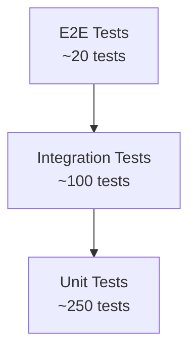

# Testing

## Test Pyramid



## Running Tests

```bash
# All tests
just test

# Backend only
just test-backend

# Frontend only
just test-frontend

# Agent only
just test-agent

# Backend with coverage
just test-backend-cov
```

## Backend Testing

### Unit Tests

```bash
cd backend && go test ./... -race -cover
```

Mock external dependencies using interfaces:

```go
type mockAgentRepo struct {
    agents map[int64]*domain.Agent
}

func (m *mockAgentRepo) FindByID(ctx context.Context, id int64) (*domain.Agent, error) {
    a, ok := m.agents[id]
    if !ok {
        return nil, domain.ErrNotFound
    }
    return a, nil
}
```

### Integration Tests

Integration-Tests mit `testcontainers-go` sind geplant:

```go
func TestJobRepository(t *testing.T) {
    ctx := context.Background()
    pg, err := testcontainers.GenericContainer(ctx, ...)
    // ... test against real PostgreSQL
}
```

## Frontend Testing

### Unit Tests (Vitest)

```bash
cd frontend && npx vitest run
```

### Component Tests

```typescript
import { fixture, html, expect } from '@open-wc/testing';
import '../src/components/jobs/job-list';

it('renders job list', async () => {
  const el = await fixture(html`<ff-job-list></ff-job-list>`);
  expect(el.shadowRoot!.querySelector('table')).to.exist;
});
```

## Coverage Targets

| Component | Target | Current |
|-----------|--------|---------|
| Backend | 80% | 0% |
| Frontend | 70% | 0% |
| Agent | 80% | 0% |
| Overall | 75% | 0% |
