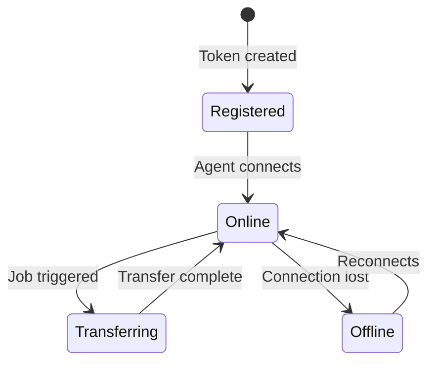

# Agents

Agents are lightweight processes that run on endpoint machines and connect to the FileFlux backend via WebSocket.

## Agent Lifecycle



## Registering an Agent

1. Navigate to **Tokens** → **Create Token**
2. Copy the generated token
3. Install and start the agent with the token

```bash
# Edit config.yaml and set connection.token, then start:
fileflux-agent -config /path/to/config.yaml
```

## Agent Details

Each agent reports:

| Field | Description |
|-------|-------------|
| Name | Hostname or configured name |
| Status | `online`, `offline` |
| IP Address | Current IP address |
| OS | Operating system |
| Architecture | CPU architecture |
| Version | Agent version |
| Last Seen | Last heartbeat timestamp |
| Uptime | Time since connection |

## System Information

The agent collects and reports:

- Hostname, OS, architecture
- CPU count and usage
- Memory total/available
- Disk usage for configured paths
- Agent version and build info

## Multi-Platform Support

| Platform | Architecture | Status |
|----------|-------------|--------|
| Linux | amd64, arm64 | ✅ Supported |
| macOS | amd64, arm64 (Apple Silicon) | ✅ Supported |
| Windows | amd64 | ✅ Supported |

## Agent Configuration

See [Configuration](../getting-started/configuration.md#agent-configyaml) for all agent settings.
