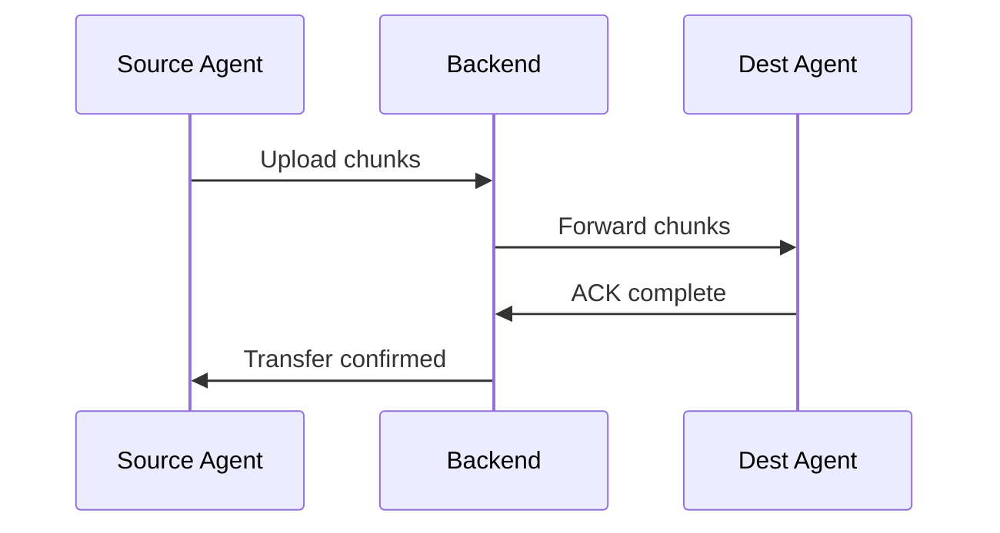
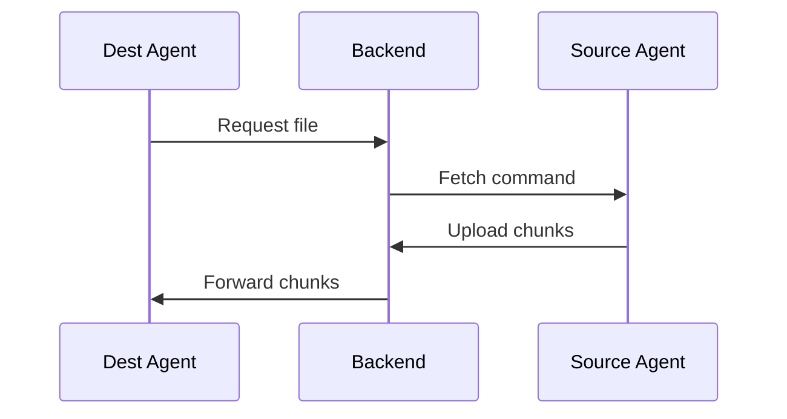

# Jobs

Jobs define file transfer operations between agents. A job specifies what to transfer, from where, to where, and when.

## Job Types

### Push Job
The source agent sends files to the destination agent via the backend relay.

### Pull Job
The destination agent requests files from the source agent.

## Creating a Job

Navigate to **Jobs** → **Create Job** and fill in:

| Field | Required | Description |
|-------|----------|-------------|
| Name | ✅ | Descriptive name for the job |
| Type | ✅ | `push` or `pull` |
| Source Agent | ✅ | Agent that has the source files |
| Source Path | ✅ | File or directory path on source agent |
| Dest Agent | ✅ | Agent to receive the files |
| Dest Path | ✅ | Directory path on destination agent |
| Schedule | ❌ | Cron expression for recurring runs |
| File Pattern | ❌ | Glob pattern to filter files (e.g., `*.csv`) |
| Description | ❌ | Human-readable description |

## Job States

| State | Description |
|-------|-------------|
| `active` | Enabled and will run on schedule |
| `inactive` | Disabled, will not run |
| `running` | Currently executing a transfer |

## Manual Execution

Click **Run Now** on any job to trigger an immediate execution, regardless of schedule.

## Job History

Each job tracks its execution history including:

- Start/end timestamps
- Transfer count and total size
- Success/failure status
- Error details (if failed)
