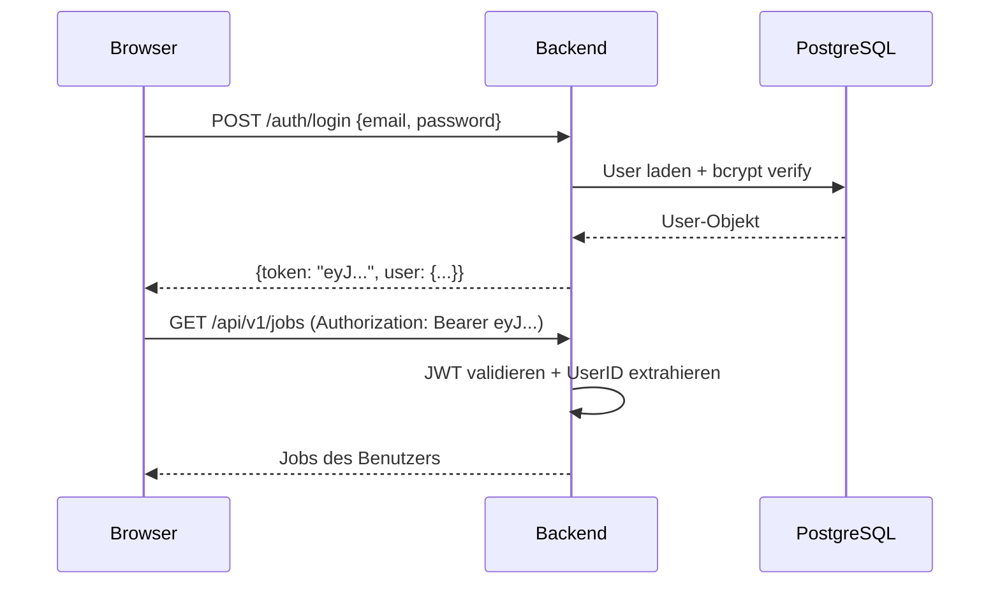

# Security

Überblick über die Sicherheitsarchitektur von FileFlux.

## Authentifizierung

FileFlux nutzt zwei separate Authentifizierungsmechanismen:

### JWT (User-Authentifizierung)



- **Algorithmus**: HS256 (HMAC-SHA256)
- **Gültigkeit**: Konfigurierbar (Standard: 24 Stunden)
- **Secret**: Konfiguriert über `jwt_secret` in `config.yaml` (mind. 32 Zeichen in Produktion)
- **Payload**: `user_id`, `email`, `role`, `exp`

### Agent-Token

Agenten authentifizieren sich mit langlebigen Token:

- Token werden bei Erstellung als Plain-Text zurückgegeben (einmalig sichtbar)
- In der Datenbank als eindeutiger String gespeichert (`tokens.token_value`)
- Validierung bei jeder WebSocket-Verbindung und File-API-Anfrage
- Können jederzeit vom Admin widerrufen werden

---

## Autorisierung

### Rollenbasierte Zugriffskontrolle (RBAC)

| Rolle | Berechtigungen |
|-------|---------------|
| `admin` | Voller Zugriff auf alle Funktionen, Agenten- und Token-Verwaltung |
| `user` | Eigene Jobs und Transfers verwalten, Agenten und Tokens einsehen |

### IDOR-Schutz (Insecure Direct Object Reference)

Alle Single-Resource-Endpoints prüfen die Eigentümerschaft:

- **Jobs**: `GetJob`, `UpdateJob`, `DeleteJob`, `RunJob` — nur eigene Jobs
- **Transfers**: `GetTransfer`, `CancelTransfer` — nur Transfers eigener Jobs (Join über `jobs.user_id`)
- Unautorisierte Zugriffe geben **404 Not Found** zurück (verhindert Information Disclosure)

---

## Passwort-Sicherheit

| Aspekt | Implementierung |
|--------|----------------|
| Hashing | bcrypt mit konfigurierbarem Cost-Faktor |
| Minimum-Länge | Wird bei Registrierung/Änderung geprüft |
| Passwort-Änderung | `POST /auth/password` — erfordert altes Passwort |

!!! warning "Standard-Passwort ändern"
    Der initiale Admin-Account wird mit `admin123` erstellt.
    **Ändern Sie dieses Passwort sofort** über die Einstellungsseite oder die API.

---

## Netzwerk-Sicherheit

### CORS

CORS-Header werden vom Backend konfiguriert. In der Entwicklung sind alle Origins erlaubt. In Produktion sollten Sie nur die Frontend-Domain zulassen.

### WebSocket-Origin-Prüfung

Die WebSocket-Verbindung prüft den `Origin`-Header:

- **Agenten** (mit `Authorization`-Header): Immer erlaubt
- **Browser-Verbindungen**: Geprüft gegen `WS_ALLOWED_ORIGINS` Umgebungsvariable
- **Entwicklung** (keine Origins konfiguriert): Alle erlaubt

```bash
# Produktion: Nur Frontend-Domain erlauben
WS_ALLOWED_ORIGINS=https://fileflux.example.com,https://www.fileflux.example.com
```

### Rate Limiting

| Endpoint | Limit |
|----------|-------|
| `POST /auth/login` | Rate-limited gegen Brute-Force |
| Alle anderen Endpoints | Über Middleware konfigurierbar |

### Request-Limits

| Ressource | Limit |
|-----------|-------|
| JSON-Body | 1 MB |
| File-Upload | 5 GB |

---

## Security Headers

Das Backend setzt Standard-Sicherheitsheader über Middleware:

- `X-Request-ID` für Request-Tracing
- CORS-Header für Cross-Origin-Anfragen
- Structured Logging mit Request-IDs

---

## Produktions-Checkliste

!!! danger "Vor dem Go-Live"

    - [ ] `JWT_SECRET` auf einen sicheren, zufälligen Wert setzen (mind. 32 Zeichen)
    - [ ] Standard-Admin-Passwort `admin123` ändern
    - [ ] `DB_PASSWORD` auf ein sicheres Passwort setzen
    - [ ] HTTPS via Reverse Proxy aktivieren (Nginx/Traefik)
    - [ ] `WS_ALLOWED_ORIGINS` auf die Frontend-Domain beschränken
    - [ ] `DB_SSLMODE` auf `require` oder `verify-full` setzen
    - [ ] Backups der PostgreSQL-Datenbank einrichten
    - [ ] Docker-Container nicht als `root` ausführen
    - [ ] Netzwerk-Segmentierung: DB nur vom Backend erreichbar

Weitere Details in der [Produktions-Dokumentation](../deployment/production.md).
