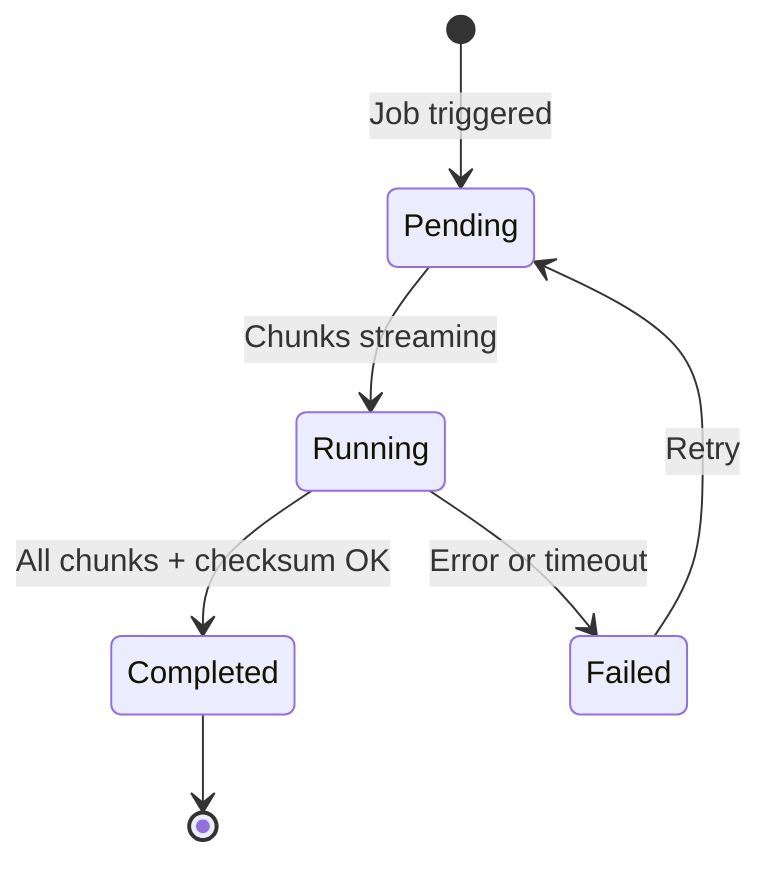

# Transfers

A transfer represents a single file being moved between two agents as part of a job execution.

## Transfer Lifecycle

## Transfer Details

Each transfer tracks:

| Field | Description |
|-------|-------------|
| ID | Unique transfer identifier |
| Job | Parent job |
| Filename | Name of the file being transferred |
| Size | Total file size |
| Status | `pending`, `running`, `completed`, `failed` |
| Source | Agent name and path |
| Destination | Agent name and path |
| Progress | Percentage complete |
| Speed | Current transfer speed (bytes/s) |
| Checksum | SHA-256 hash for integrity verification |
| Started At | When the transfer began |
| Completed At | When the transfer finished |
| Error | Error message (if failed) |

## Chunked Transfer

Files are split into chunks (default 8 MB) for reliable transfer:

1. Source agent reads a chunk from disk
2. Chunk is compressed (zstd or LZ4)
3. SHA-256 hash is computed per chunk
4. Chunk is sent as a binary WebSocket frame (57-byte header + compressed data)
5. Backend relays the chunk to the destination agent
6. Destination agent verifies the hash, decompresses, and writes to disk
7. After all chunks, the full file SHA-256 is verified

### Compression

| Algorithm | Beschreibung |
|-----------|-------------|
| zstd | Standard — gute Balance aus Geschwindigkeit und Kompressionsrate |
| LZ4 | Ultra-schnell — ideal für LAN-Transfers mit geringer Latenz |
| none | Keine Kompression — für bereits komprimierte Dateien |

## Retry Behavior

Failed chunks are automatically retried up to `TRANSFER_MAX_RETRIES` times (default: 3). If all retries fail, the transfer is marked as failed and the job reports an error.

## Filtering Transfers

The transfer list supports filtering by:

- Status (pending, running, completed, failed)
- Job name
- Agent name
- Date range
- Filename

## Bulk Operations

Select multiple transfers to:

- **Retry** — Re-run failed transfers
- **Cancel** — Cancel pending/running transfers
