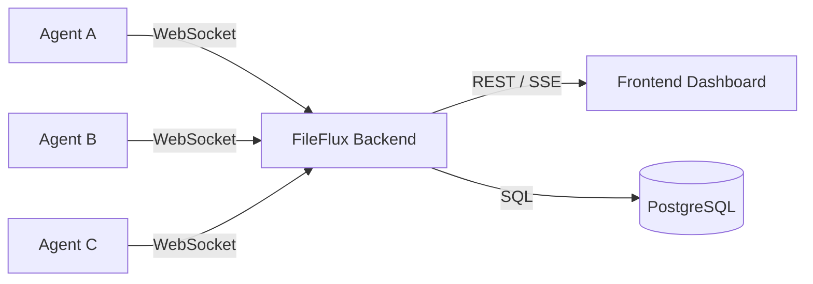

FileFlux is an **Enterprise Managed File Transfer** platform — self-hosted, secure, and simple.

Move files between N-to-M endpoints with real-time monitoring, scheduling, and full audit trails.

!!! info "Get Started"
    Install FileFlux and run your first transfer in under 5 minutes.

    [Quick Start →](getting-started/quick-start.md)

## Who Is FileFlux For?

!!! info "IT Operations & Infrastructure"
    Automate recurring file transfers between servers, partners, and cloud storage. Replace fragile cron+scp scripts with monitored, resumable transfers.

!!! info "Security & Compliance Teams"
    End-to-end encryption, complete audit trails, GDPR-ready. Know exactly who moved what file, when, and where — with cryptographic proof.

!!! info "Developers & Integrators"
    REST API, WebSocket real-time control, and a lightweight Go agent. Integrate file transfers into CI/CD pipelines, ETL workflows, or custom apps.

## Key Features

| Feature | Description |
|---------|-------------|
| **Chunked Transfers** | Files are split into chunks for reliable, resumable transfers — even over unstable connections. |
| **Push & Pull** | Initiate transfers in either direction between any agents. N-to-M topology. |
| **Cron Scheduling** | Schedule transfers with cron expressions. Flexible recurrence, retry logic, and timeout handling. |
| **Real-Time Monitoring** | Live dashboard with transfer progress via Server-Sent Events. |
| **Multi-Platform Agent** | Lightweight Go agent for Linux, macOS, and Windows. Single binary, zero dependencies. |
| **Audit Trail** | Complete transfer history with timestamps, checksums, and user attribution. |
| **WebSocket Control** | Real-time agent communication via persistent WebSocket connections. |
| **REST API** | Full REST API for automation and integration. Every resource is programmable. |

## Architecture at a Glance



| Component | Technology |
|-----------|-----------|
| **Backend** | Go 1.22 · Clean Architecture · gorilla/mux · gorilla/websocket |
| **Frontend** | Lit 2.6 · TypeScript · Vite 6 |
| **Agent** | Go 1.21 · Single Binary · Multi-Platform |
| **Database** | PostgreSQL 16 |
| **Deployment** | Docker Compose · Traefik · Let's Encrypt |

## Documentation Map

| Section | Audience | Description |
|---------|----------|-------------|
| [Getting Started](getting-started/quick-start.md) | Everyone | Install, configure, first login — up and running in 5 minutes. |
| [User Guide](guide/dashboard.md) | Operators | Jobs, agents, transfers, tokens, scheduling, and monitoring. |
| [Architecture](architecture/overview.md) | Developers | System design, WebSocket protocol, database layer, clean architecture. |
| [API Reference](api/rest.md) | Developers | REST endpoints, WebSocket messages, request/response schemas. |
| [Development](development/contributing.md) | Contributors | Code style, testing, CI/CD, how to contribute. |
| [Deployment](deployment/installation-guide.md) | DevOps | Docker, production hardening, environment variables, TLS. |

## Get Started in 5 Minutes

```bash
git clone https://github.com/stefanposs/file-flux.git
cd file-flux
just setup
just dev
```

Open [http://localhost:3000](http://localhost:3000) and log in with `admin@fileflux.de` / `admin123`.
